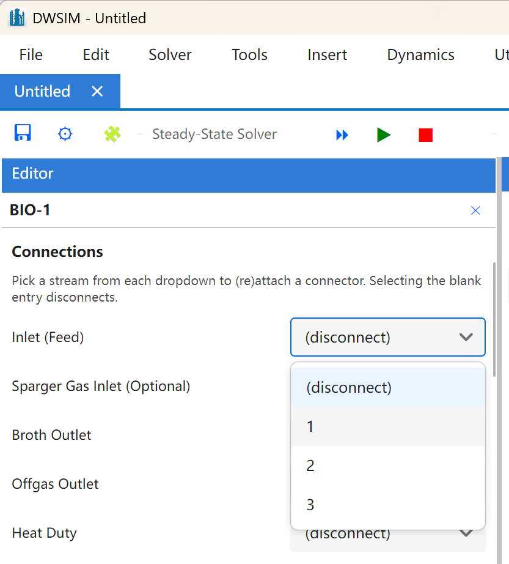
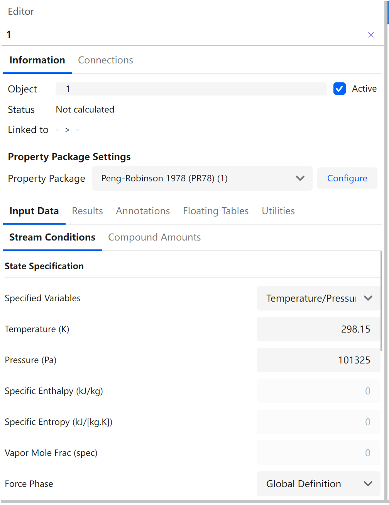

# Process Modeling (Flowsheeting)

#### Inserting Flowsheet Objects

An object is added to the flowsheet in any of three ways:

- Drag its icon from the **Objects** palette onto the diagram.

- Double-click its icon on the palette, which drops the object at the centre of the current view.

- Right-click an empty area of the diagram and pick it from **Add New Object**.

Material and energy streams, property tables, charts and text blocks are also on the **Insert** menu, which places them at the centre of the view. The palette groups the objects by category; the category is chosen at the top of the panel.

The elements of a simulation (objects) which can be added to the flowsheet are:

- **Material Stream:** used to represent matter which enters and leaves the limits of the simulation and passes through the unit operations. The user should define their conditions and composition in order for DWSIM to calculate their properties accordingly;

- **Energy Stream:** used to represent energy which enters and leaves the limits of the simulation and passes through the unit operations;

- **Mixer:** used to mix up to three material streams into one, while executing all the mass and energy balances;

- **Splitter:** mass balance unit operation - divides a material stream into two or three other streams;

- **Valve:** works like a fixed pressure drop for the process, where the outlet material stream properties are calculated beginning from the principle that the expansion is an isenthalpic process;

- **Pipe:** simulates a fluid flow process (mono or two-phase). The pipe implementation in DWSIM provides the user with various configuration options, including heat transfer to environment or even to the soil in buried pipes. Two correlations for pressure drop calculations are available: Beggs and Brill and Lockhart and martinelli. Both reduces to Darcy equation in the case of single-phase flow;

- **Pump:** used to provide energy to a liquid stream in the form of pressure. The process is isenthalpic, and the non-idealities are considered according to the pump efficiency, which is defined by the user;

- **Separator Vessel:** used to separate the vapor and liquid phases of a stream into two other distinct streams;

- **Compressor:** used to provide energy to a vapor stream in the form of pressure. The ideal process is isentropic (constant entropy) and the non-idealities are considered according to the compressor efficiency, which is defined by the user;

- **Expander:** the expander is used to extract energy from a high-pressure vapor stream. The ideal process is isentropic (constant entropy) and the non-idealities are considered according to the expander efficiency, which is defined by the user;

- **Heater:** simulates a stream heating process;

- **Cooler:** simulates a stream cooling process;

- **Conversion Reactor:** simulates a reactor where conversion reactions occur;

- **Equilibrium Reactor:** simulates a reactor where equilibrium reactions occur;

- **PFR:** simulates a Plug Flow Reactor (PFR);

- **CSTR:** simulates a Continuous-Stirred Tank Reactor (CSTR);

- **Shortcut Column:** simulates a simple distillation column with approximate results using shorcut calculations;

- **Distillation Column:** simulates a distillation column using rigorous thermodynamic models;

- **Absorption Column:** simulates an absorption column using rigorous thermodynamic models;

- **Heat Exchanger:** simulates a countercurrent heat exchanger using rigorous thermodynamic models.

- **Component Separator:** model to simulate a generic process for component separation.

- **Solids Separator:** model to simulate a generic process for solid compound separation.

Additionally, the following logical operations are available in DWSIM:

- **Adjust:** used to make a variable to be equal to a user-defined value by changing the value of other (independent) variable;

- **Recycle:** used to mix downstream material with upstream material in a flowsheet.

#### Connecting/Disconnecting objects

The material and energy streams represent mass and energy flowing between unit operations. There are two ways to attach them:

- Select the object and use the comboboxes on the **Connections** tab of the Editor panel. There is one combobox per inlet and outlet port, listing the streams that can be attached to it; choosing the blank entry disconnects the port.

- Click **Connect Objects** on the toolbar, then click the source object and the target object in turn. The mode stays on until the button is clicked again or Esc is pressed.

Holding Shift while double-clicking an object opens its Connections tab directly. **Disconnect All**, in the Edit menu and in the flowsheet context menu, removes every connection of the selected object at once.

*The Connections tab of the Editor panel.*

#### Process data management

##### Entering process data

The process data of an object - temperature, pressure, flow, composition and any other parameter - is entered in the **Editor** panel, docked at the left of the window. Clicking an object on the diagram brings its editor up; so does double-clicking it, or **Edit/View** in the object’s context menu. The editor is divided into tabs:

- **Connections** - the inlet and outlet ports.

- **Properties** - the calculation mode and the input data it requires, plus the property package assigned to the object.

- **Custom Properties** - the properties added by an extension attached to the object.

- **Dynamics** - the parameters used only in dynamic mode.

- **Results** - the calculated values, available once the object has been solved.

- **Appearance** - the size, rotation, colours and label of the drawing on the diagram.

Only the tabs that apply to the selected object are shown. **View \> Close All Opened Editors** clears the panel.

*The Editor panel.*

#### Running a Simulation

DWSIM is a sequential modular process simulator, that is, all calculations are made in a per-module basis, according to the connections between the objects. The calculator checks if an object has all of its properties defined and, if yes, passes the data for the downstream object and calculates it, repeating the process in a loop until it reaches an object that doesn’t have any of its dowstream connections attached to any object. This way, the entire flowsheet can be calculated as many times as necessary without having to "tell" DWSIM which object must be calculated. In fact, this is done indirectly if the user define all the properties and make all connections between objects correctly.

To solve the flowsheet, press F5, click **Solve** on the toolbar or use **Solver \> Solve**. As DWSIM’s solver does its job, messages are shown in the Log panel. These messages tell the user if the object was calculated successfully or if there was an error while calculating it, and an object that failed is marked in red on the diagram.

Three more commands sit next to it:

- **Abort** stops a run that is in progress.

- **Force Solve** recalculates every object, including the ones the solver considers up to date.

- **Flowsheet Calculator Active** (F6) suspends automatic recalculation. Turn it off while making a series of changes, then turn it back on and solve once.

If the calculation finishes without errors, you can proceed to viewing the results.

*The Flowsheet Solver doing its work.*

#### Viewing Results

Results can be read in four places:

- The **Results** panel: pick an object from the list at the top and read its calculated properties, either as a grid of property, value and units, or as a text report.

- The **Material Streams** panel: every material stream side by side, one column each, with one row per property. The specified properties of feed streams can also be edited here.

- The **Results** tab of the Editor panel, for the object currently selected.

- **Results \> Markdown Report Viewer**, which builds a report over the objects and properties you choose.

The diagram itself can be written out as a PNG image, an SVG drawing or a PDF file from **File \> Export Flowsheet**.

*The Results panel.*

*The Results tab of the Editor panel.*

#### Flowsheet States

The **Flowsheet States** group on the toolbar keeps named snapshots of the solved flowsheet. **Store Current** saves the present solution under a name, **Restore Selected** puts it back, and **Remove Selected** discards it. It is a quick way of comparing operating cases without keeping several files.

#### The Spreadsheet

The **Spreadsheet** panel is an ordinary spreadsheet whose cells can also read from and write to the flowsheet. Six functions make the link:

- **GETOBJID** and **GETOBJNAME** - the identifier and the name of an object.

- **GETNAME** - the name of the object with a given identifier.

- **GETPROPVAL** and **GETPROPUNITS** - the value of a property of an object, and the unit it is expressed in.

- **SETPROPVAL** - writes a value into a property of an object.

Values read and written through these functions are converted to and from the simulation’s system of units, so a spreadsheet keeps working when the units are changed.

The toolbar above the sheet adds, renames and removes worksheets, recalculates them, imports and exports data against the flowsheet, builds a chart from the selected range, opens and saves the sheet as a separate file, and sets alignment, number of decimals and cell merging. The contents are saved inside the simulation file.

#### Scripts

Scripts belong to the simulation and are saved with it. They are written and run in **Tools \> Script Manager**, in Python, C# or Visual Basic, with syntax highlighting, an editable snippet list and a link to the scripting API documentation. Python scripts run on either the IronPython interpreter that ships with DWSIM or on the CPython installation configured in the Preferences window.

A script is run with **Run**, or with **Run Async**, which keeps the interface responsive while a long script works. It can also be attached to a flowsheet event - the checkbox **Run on event** and the object and event selectors next to it - so that it runs by itself when that event happens.

#### Flowsheet Analysis

The **Flowsheet Analysis** menu holds the studies that drive the solver repeatedly:

- **Sensitivity Analysis** - varies one independent variable between two limits over a number of points, solving the flowsheet at each one and recording the variables chosen for observation.

- **Multivariate Optimizer** - minimises or maximises an objective function by adjusting a set of decision variables within their bounds.

- **Mass and Energy Balance Summary** - what enters and what leaves the flowsheet boundary, and the resulting imbalance.

- **Property Chart** - a chart of one property across all the objects of a given type.

Sensitivity and optimization cases are stored in the simulation file, so a study set up once is still there the next time the file is opened.

#### The Inspector

The **Inspector** records what happened inside each calculation: which routine was called, with which arguments, and the intermediate values it produced. It is switched on with the magnifier button on the toolbar and read in **Tools \> Inspector Reports**, which shows the report of the object selected on the left. Because it keeps a full trace of every call, it slows the solver down and should be turned off again once the question it was opened for has been answered.

#### Flowsheet Utilities

DWSIM includes a number of utilities which give the user more information about the process being simulated. They are gathered in the **Utilities** menu:

- **Phase Envelope** - the phase equilibrium envelope of a material stream, in any of twelve property pairs.

- **Binary Envelope** - Txy, Pxy and xy diagrams for a binary mixture.

- **Ternary Envelope (LLE)** - the liquid-liquid envelope of a ternary mixture at a fixed temperature and pressure.

- **True Critical Point** - the true critical point of a mixture (Peng-Robinson and Soave-Redlich-Kwong only).

- **Natural Gas Hydrates** - the hydrate formation conditions of a stream.

- **Petroleum Cold Flow Properties** - the cold flow properties of a petroleum stream.

- **Pressure Safety Valve Sizing** - the orifice area required by a relief valve.

- **Gas-Liquid Separator Sizing** - vertical and horizontal separator dimensions.

- **Vessel Depressurization** - the pressure, temperature, released flow and wall temperature history of a vessel blown down through an orifice or a valve, or relieving under a pool fire; it lives on the Dynamics menu (see Section[2.45](#sec:vessel_depressurization)).

- **Column Internals** - the fraction of flood, pressure drop, weeping, entrainment and downcomer backup of the trays, or the pressure drop, holdup, HETP and bed height of the packings of a solved rigorous column, stage by stage, with sizing for a target fraction of flood (see Section[2.46](#sec:column_internals)).

**Pure Compound Properties**, which needs no stream at all, is on the **Tools** menu together with the compound creation and petroleum characterization tools.

Utilities calculate their properties for a single stream only. In the majority of cases, this object must be calculated in order to be available for selection in the utility window.

##### Pure Component Properties

The Pure Component Properties utility is used to view and edit pure component constants, view molecular properties and general temperature dependent properties like ideal gas Cp, vapor pressure, liquid viscosity and vaporization enthalpy.

*Pure Compound Property Viewer.*

##### Phase Envelope

The Phase Envelope utility allows the visualization of the existing relations between thermodynamic properties of a mixture of components in a material stream. The following phase envelopes can be generated in DWSIM: Pressure-Temperature, Pressure-Enthalpy, Pressure-Entropy, Pressure-Volume, Temperature-Pressure, Temperature-Enthalpy, Temperature-Entropy, Temperature-Volume, Volume-Pressure, Volume-Temperature, Volume-Enthalpy and Volume-Entropy.

###### Envelope Options

For the Pressure-Temperature envelope type, the following additional curves and overlays can be enabled from the Envelope Options tab:

- **Quality Line** - adds an iso-quality (constant vapor fraction) line inside the two-phase region. The vapor mole fraction value is configurable between 0 and 1.

- **Stability Curve** - plots the liquid-liquid equilibrium (LLE) instability boundary. Works with the Peng-Robinson (PR) and Soave-Redlich-Kwong (SRK) property packages.

- **Phase Identification Curve** - separates liquid-like from vapor-like single-phase behavior using the Peng-Robinson EOS. The region above the curve corresponds to a liquid-like phase.

- **Operating Point** - marks the material stream’s current temperature and pressure on the diagram.

- **Solid-Liquid Equilibrium** - draws solidus and liquidus curves showing where solid phases begin to form and where complete solidification occurs. Requires compounds with fusion data (temperature of fusion and enthalpy of fusion).

- **Widom Line** - plots the loci of heat capacity (Cp) and isothermal compressibility maxima in the supercritical region, extending from the critical point. An averaged curve of the two is also displayed. These lines divide the supercritical region into liquid-like and vapor-like zones.

###### Phase Region Fills

The Pressure-Temperature diagram displays semi-transparent colored regions with labels identifying the thermodynamic state: Solid (S), Solid+Liquid (S+L), Liquid (L), Vapor+Liquid (V+L), Vapor (V) and Solid+Vapor+Liquid (S+V+L). When the Widom line is enabled, the supercritical region is further divided into Liquid-like (L-like) and Vapor-like (V-like) zones.

###### Custom Initialization

The BP Initialization and DP Initialization tabs allow custom starting parameters (initial temperature, pressure, step sizes and maximum points) for the bubble-point and dew-point curve tracing algorithms. Use these options when the default automatic initialization produces incomplete or invalid curves.

*Phase Envelope Utility.*

##### Binary Envelope

The Binary Envelope utility is a specialized phase envelope builder for viewing specific two-component diagrams (T-x-y, P-x-y, etc.). For the T-x-y diagram type, different equilibrium lines can be calculated, depending on Property Package and Flash Algorithm selections.

*Binary Envelope Utility.*

#### Electrolyte Utilities

DWSIM ships three flowsheet-level utilities dedicated to aqueous electrolyte systems. They are added to the**Utilities** menu whenever the Electrolytes extension package is installed. The utilities are independent of the property package currently assigned to the flowsheet — they operate on their own sidecar parameter databases so the canonical JSON files shipped with DWSIM are never mutated.

- Electrolyte Phase Diagram — generates salt solubility and phase diagrams for binary and ternary aqueous electrolyte systems using either the eNRTL or Extended UNIQUAC model.

- Extended UNIQUAC Parameter Fitting — regresses UNIQUAC volume/surface parameters (r, q) and binary interaction energies (u0, uT) against mean ionic activity coefficient, osmotic coefficient and solubility data.

- eNRTL Parameter Fitting — regresses the water–electrolyte ( $\tau_{w,ca}$ , $\tau_{ca,w}$ ) interaction parameters and, optionally, the non-randomness parameter $\alpha$ against the same data types.

##### Electrolyte Phase Diagram

The Electrolyte Phase Diagram utility draws salt solubility curves and liquid-phase equilibrium diagrams at user-specified temperatures for binary salt/water and selected ternary systems. Both the eNRTL and Extended UNIQUAC models can be selected as the activity-coefficient engine; in either case the utility reads the parameter values directly from the Electrolytes extension JSON databases. Diagrams are rendered with OxyPlot and may be exported as PNG images or as comma-separated tabular data for use in external tools.

Typical workflow:

1.  Select the activity-coefficient model (eNRTL or Extended UNIQUAC).

2.  Pick the salt (or salt pair) of interest from the built-in database.

3.  Choose the diagram type (solubility vs. temperature, isothermal ternary, mean activity coefficient vs. molality, osmotic coefficient vs. molality).

4.  Set the temperature (or temperature range) and molality range.

5.  Click**Generate** to build the diagram.

##### Extended UNIQUAC Parameter Fitting

The Extended UNIQUAC Fitting tool regresses Extended UNIQUAC model parameters against experimental data for a single binary salt/water system at a single temperature. Any combination of the following data types can be used simultaneously:

- Mean ionic activity coefficient $\gamma_{\pm}$ as a function of molality.

- Osmotic coefficient $\phi$ as a function of molality.

- Solubility product $K_{\mathrm{sp}}$ at saturation (log-space residual).

The user enters salt stoichiometry (species names, charges, stoichiometric coefficients), the UNIQUAC $r$ and $q$ parameters for the ions, a baseline interaction-parameter set, and the list of interaction pairs to regress (base energy $u_{ij}^{0}$ and/or temperature coefficient $u_{ij}^{T}$ , see Eq. $u_{ij}(T)=u_{ij}^{0}+u_{ij}^{T}(T-298.15)$ ). Experimental points are entered in a tabular grid, with per-point weights and flags indicating which of $\gamma_{\pm}$ , $\phi$ and $K_{\mathrm{sp}}$ apply.

Optimization is performed by a bounded Nelder–Mead simplex that minimises the sum of relative-residual squares across all enabled data types. Progress is reported in a running log, and experimental vs. calculated $\gamma_{\pm}$ and $\phi$ curves are plotted side-by-side with the experimental points. The**Save sidecar…** command writes the fitted parameters to a user-selected JSON file (sidecar) so the canonical`ExtendedUNIQUAC_Parameters.json` database shipped with DWSIM is never overwritten. Sidecar files can be loaded by the Extended UNIQUAC property package at runtime as overrides.

##### eNRTL Parameter Fitting

The eNRTL Fitting tool is the electrolyte-NRTL counterpart of the Extended UNIQUAC tool and shares the same user interface, solver, plotting and sidecar-persistence conventions. The adjustable parameters are the two asymmetric water–electrolyte interaction energies $\tau_{w,ca}$ (water around the cation–anion pair) and $\tau_{ca,w}$ (ion pair around water), and, optionally, the non-randomness parameter $\alpha$ . Baseline values can be loaded from the built-in`ENRTL_Parameters.json` database through the**Populate** button; initial guesses, lower/upper bounds and a flag indicating whether the parameter is active in the regression are all user-editable.

As with the Extended UNIQUAC tool, the objective function is the sum of relative-residual squares over $\gamma_{\pm}$ , $\phi$ and $K_{\mathrm{sp}}$ data enabled in the experimental-data grid, minimised by a bounded Nelder–Mead simplex. Fitted parameters are written to a JSON sidecar that can be picked up at runtime by the eNRTL property package.

