# Operator Training Simulator (OTS)

#### What it is

A process simulator answers the question *what would the plant do?* An operator training simulator asks a different one: *what would the operator do?* The Operator Training Simulator (OTS) turns a dynamic DWSIM flowsheet into a training rig. An instructor runs the plant at a chosen speed, freezes it while talking, injects faults and scores the trainee. The trainee runs the plant from a control-room screen with faceplates, alarms, trends and interlocks, and never sees the flowsheet. Training simulators of this kind are standard practice in the process industries, and the reasons for using them (safer start-ups, fewer trips, operators who have already seen the abnormal situation before it happens) are well documented .

The OTS is part of the Classic (Windows) edition of DWSIM Patreon, level 3 (Premium+). Once the subscription is active, an **Operator Training** menu appears on the main menu bar with five entries: **Instructor Station**, **Operator Panel**, **Operator Screens**, **Operator Screens Designer** and **Operator Station (Remote)**. The cross-platform edition does not have them.

The system has six parts, all built on the dynamic flowsheet described earlier in this chapter:

- **The training session**, which owns the clock: a paced integration with a speed factor, freeze and single step, snapshots and backtracking, and a journal of everything that happens.

- **The Instructor Station**, the window where the instructor drives the session: scenarios, malfunctions, snapshots, the journal and the score.

- **The operator side**: a generated Operator Panel with one tile per controller, valve and piece of equipment, and designed Operator Screens that look like the plant P&ID, both with faceplates, an alarm banner and trends.

- **Alarms and interlocks**: an alarm summary with acknowledgement, and a safety system with trip logic, latching, bypass, reset and first-out.

- **Ways out of the session**: an OPC UA server for external HMIs and PLC test benches, and remote operator stations that mirror the session on other PCs.

- **A pressure-flow network solver** that balances the flows through valves in series and around mixers, every step.

Scenarios, operator screens and interlock logic are stored inside the flowsheet file (.dwxmz). Save the flowsheet after editing any of them and a colleague who opens the same file gets the same exercises, screens and trips.

The sections below follow the order in which you would set a course up: prepare the plant, learn the instructor controls, add faults, package them into scored scenarios, build what the trainee sees, and finally run a session. A complete hands-on course with a sample plant is available on the DWSIM Tutorials site, in the Operator Training section.

#### Preparing the plant model

A training simulator is only as good as the plant behind it. In dynamic mode two kinds of objects share the work: **holdups** (separators, tanks, pumps, heaters, coolers, heat exchangers, reactors) accumulate mass and energy and set the pressure of the streams around them; **valves** turn a pressure difference into a flow through the Kv equation. A stream between a holdup and a valve therefore has a pressure given by the holdup and a flow given by the valve. Feed and product streams that touch nothing on one side keep the specification you give them: a fixed pressure (a header) or a fixed flow.

Before a flowsheet can be used by the OTS, go through this list once:

1.  Solve it in steady state first. A dynamic run needs a consistent starting point.

2.  Give every holdup a volume and a height (Dynamics tab of the object editor). Vessels default to zero volume, which produces immediate pressure spikes.

3.  Put every control valve in a Kv mode (Kv general, liquid, gas or steam) and enter a realistic Kv; the steady-state sizing tool on the valve gives you one. Set the opening/Kv relationship and, if you want a realistic actuator, a time constant and a delay.

4.  Give pumps a flow conductance, a volume, a rated speed and a target speed, so that a trip can stop them; add inertia and motor torque if you want a coast-down.

5.  Set the stream specifications: Flow on fixed feeds, Pressure everywhere else.

6.  Add a gauge (analog, digital or level) for every variable the trainee must see, with its LL, L, H and HH alarm limits.

7.  Create a schedule with an integrator and a step (5 s is a good start), run it for a few minutes of simulated time and store the resulting state as the initial flowsheet state of the schedule. The OTS restores this state every time a session starts fresh; without it, each run starts wherever the last one ended.

8.  Save the file.

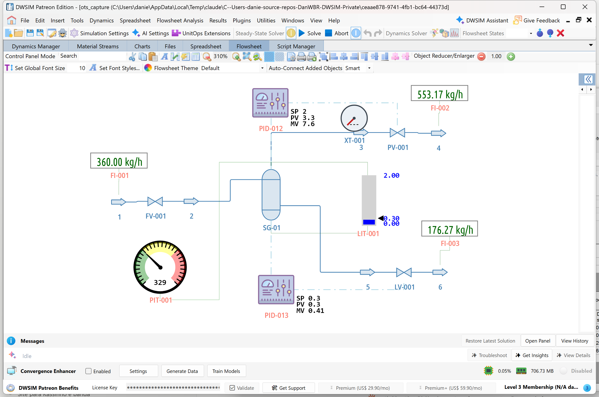

*The sample plant of the tutorial course in dynamic mode: a gas-liquid separator with a pressure loop, a level loop, three Kv valves and five gauges.*

#### The Instructor Station

The Instructor Station owns the training session. Open it from the Operator Training menu; the window can stay open next to the flowsheet, and the trainee windows are separate.

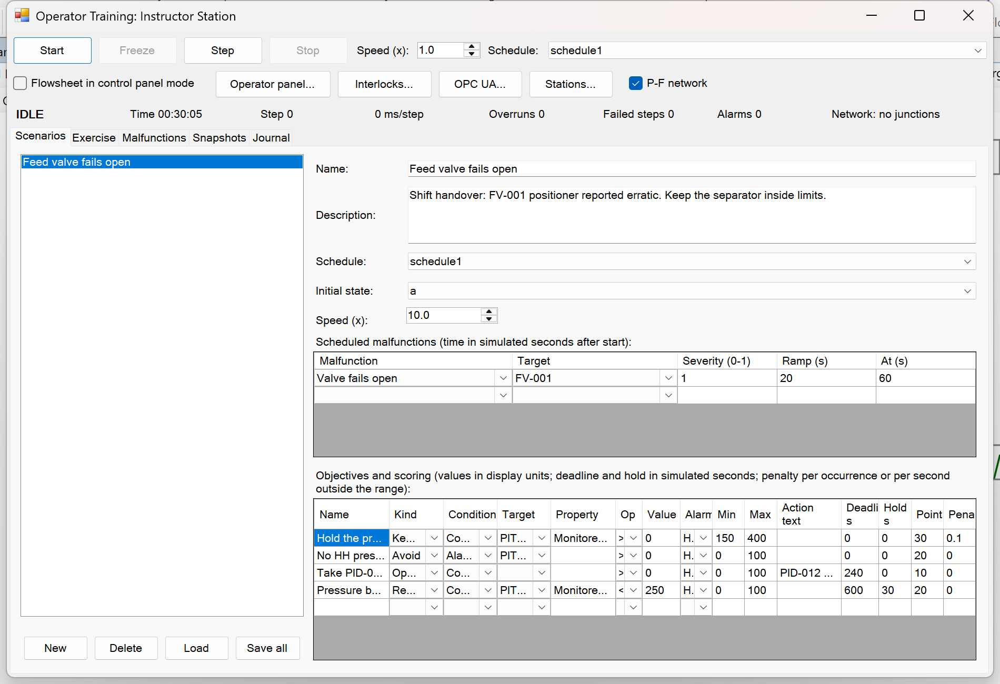

*The Instructor Station: toolbar, status line and the Scenarios tab.*

##### The toolbar

|  |  |
|:---|:---|
| **Control** | **What it does** |
| **Start** | Starts a fresh session: restores the initial state of the schedule, resets alarms, trends and the score, and runs. After a Freeze, the same button resumes. |
| **Freeze** | Stops at the end of the current step and keeps everything. Use it to explain something, to take a snapshot, or before restoring one. |
| **Step** | Solves exactly one step. From idle it also starts a fresh session. |
| **Stop** | Ends the session. The next Start begins again from the initial state. |
| **Speed (x)** | Simulated seconds per wall-clock second, from 0.1 to 20. With a 5 s step, 1x means one step every 5 s of your time and 10x one step every 0.5 s. It can be changed while running. |
| **Schedule** | The dynamics schedule the session runs (its integrator, initial state and event list). |
| **Flowsheet in control panel mode** | Switches the flowsheet window to control panel mode, where the trainee can touch controllers and valves on the drawing. The operator windows described below are better for the trainee; this checkbox is for quick demonstrations. |
| **Operator panel..., Interlocks..., OPC UA..., Stations...** | Open the operator panel, the interlock editor, the OPC UA server and the remote stations window. |
| **P-F network** | Turns the pressure-flow network solver on (the default) or off. |

##### The status line

While the session runs, the status line reads something like *RUNNING, Time 00:02:35, Step 31, 180 ms/step, Overruns 0, Failed steps 0, Alarms 1, Network: no junctions*. Time is simulated time since Start. The milliseconds per step tell you how long the last step took on the wall clock; the session sleeps for the rest of the step budget, which is the step divided by the speed factor. **Overruns** counts the steps that took longer than their budget. A few are harmless; a steady stream means the speed factor is higher than the PC can deliver, so lower it or increase the integration step in the Dynamics Manager. **Failed steps** counts the steps the solver could not complete.

##### Snapshots and backtracking

The **Snapshots** tab stores and restores the whole plant state. **Save snapshot** (with a name) works only while the session is frozen. **Restore** brings the plant back to a snapshot and leaves the session frozen so you can resume from there. **Backtrack** rewinds the plant by a number of simulated seconds using the historian, which needs **Enable historian** in the Dynamics Manager. Snapshots are ordinary stored flowsheet states, so they are saved with the file and can serve as the initial state of a scenario.

A good use of backtrack: when the trainee has just made a wrong move, freeze, backtrack 60 seconds, explain, and resume. The journal keeps both attempts.

##### The journal

The **Journal** tab lists everything that happened with its simulated time and its wall-clock time, in categories you can filter: Session (started, stopped, resumed, scenario loaded, stations connecting), Instructor (freeze, step, snapshots, backtrack, malfunctions activated by hand), Operator (set point changed, controller to manual, valve opened, pump started, alarm acknowledged), Alarm (active or cleared, with the value), Trip (interlock tripped, reset, bypassed, first-out), Malfunction (armed, activated, cleared) and Solver (steps that failed and why, network notes). **Export CSV** writes the whole list for the debriefing.

Operator actions are detected in two ways. Anything done through the OTS windows is journaled directly with the trainee wording, for instance *PID-012 set point -\> 2.5 bar*. Changes made on the flowsheet in control panel mode are picked up by comparing controllers, valves and switches between steps.

##### When a step fails

Dynamic solves fail now and then: a flash does not converge, a vessel runs empty. The standard integrator stops. The OTS session instead restores the state from before the step, writes *Step failed to solve, plant held at the last good state* with the reason in the Solver category, counts it in Failed steps and tries the next step. After ten consecutive failures it freezes itself and says why, so a broken plant does not run away while you are talking to the trainee. The usual causes are a fully closed valve on a fixed-flow feed or a holdup that emptied.

#### Malfunctions

A training session is about things going wrong. The instructor injects malfunctions into the running plant from the **Malfunctions** tab: a valve that sticks, a pump that trips, a sensor that lies. Pick the flowsheet object (the list of malfunctions then only shows the kinds that apply to it; the two plant-wide faults appear with no object selected), set a **severity** from 0 to 1 and a **ramp** in simulated seconds over which the fault builds up (zero means a step change), and press **Activate**. **Deactivate** clears the fault and the plant recovers as far as physics allows.

Malfunctions can be activated while running or frozen. They are applied at the start of every step, before the controllers act, so a controller cannot undo them.

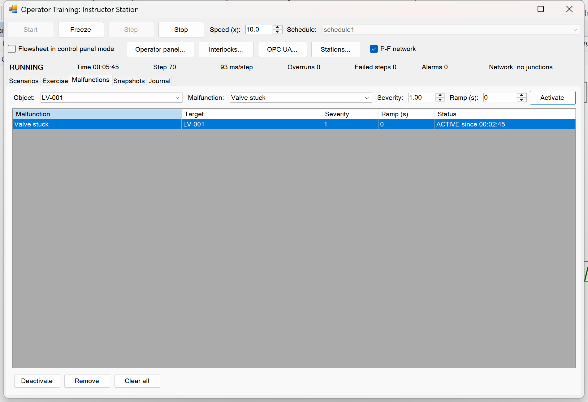

*The Malfunctions tab with a stuck level valve active.*

|  |  |  |
|:---|:---|:---|
| **Malfunction** | **Applies to** | **What happens** |
| Valve stuck | Valve | The stem stops where it is. The valve rejects what the controller writes, so the displayed opening is the real one. |
| Valve fails closed, fails open | Valve | The stem travels to 0 % or 100 % over the ramp and ignores the controller meanwhile. |
| Valve passing | Valve | The valve no longer shuts tight: the opening cannot drop below the severity times 100 %. |
| Pump trip | Pump | The target speed goes to zero and the pump coasts down at the rate its inertia allows; the pressure rise follows the speed squared. Clearing the fault restarts the motor. |
| Exchanger fouling | Heat exchanger | The fouling resistance grows at a rate proportional to the severity. |
| Utility loss | Heater, cooler in fixed-duty mode | The duty falls to (1 - severity) of what it was, over the ramp. |
| Sensor frozen, drift, bias, full scale, zero | Transmitter | The reading stops updating, drifts, is offset, or pins at the top or the bottom of the span. |
| Power failure | Plant-wide | Every pump trips and every heater and cooler loses its duty. |
| Instrument air failure | Plant-wide | Every control valve goes to its fail position (closed unless listed as fail-open). |

#### The Transmitter block

Controllers and gauges in DWSIM read the true process value. Real instruments lag, delay, add noise and fail. The **Transmitter** is a unit operation the OTS adds to the object palette (its tag starts with XT-): it sits between a process variable and whoever reads it. In its editor, **Process value and alarms...** opens the same editor a gauge has, where you choose the object and property to measure, the units and the alarm limits. The **span** (low and high, in display units), a first-order **time constant**, a **dead time** and a **noise** standard deviation complete the instrument. While the session runs, the editor shows the true value and the measured value side by side.

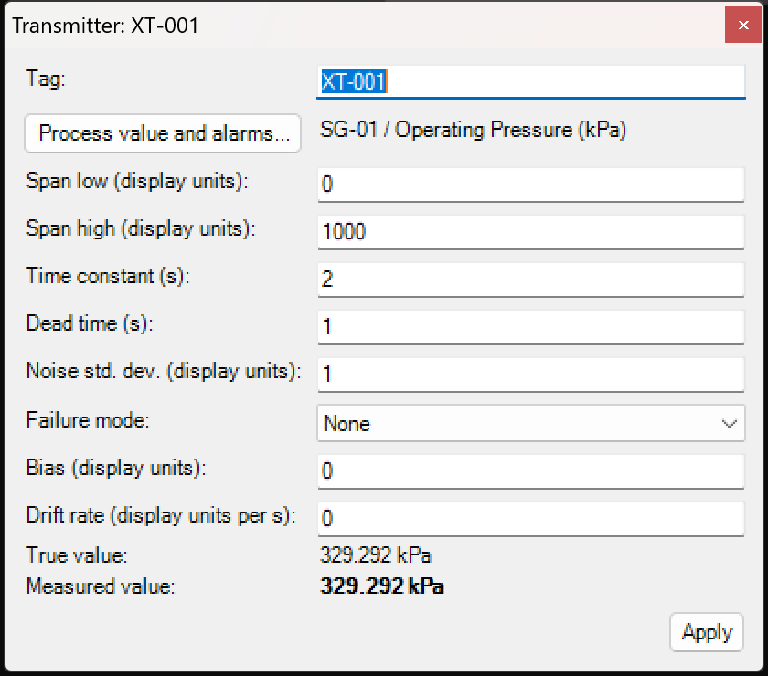

*The Transmitter editor.*

To make a controller read the instrument, open the controller and change its controlled variable to the Monitored Value of the transmitter. From then on every sensor malfunction becomes a lesson. With a frozen pressure transmitter, the controller thinks nothing changes, the real pressure drifts, and a gauge that still reads the true value disagrees with the faceplate; the trainee has to notice the disagreement and switch to manual. With a drifting one, the controller slowly moves the real pressure away from the set point while its own display looks perfect. The alarms of a transmitter are computed on the measured value, like a real DCS.

#### Scenarios, objectives and scoring

A **scenario** is a saved exercise: where the plant starts, how fast the clock runs, which faults come in and when, and what the trainee has to achieve to pass. Scenarios live inside the flowsheet file, so the same exercise can be run by any instructor with the file. The **Scenarios** tab lists them; **New** adds one, **Save all** writes them to the flowsheet, and **Load** makes the selected scenario the active one, restoring its initial state, arming its faults and resetting its objectives.

A scenario has a name and a description, a schedule, an initial state (any stored flowsheet state, including snapshots), a starting speed factor, a list of **scheduled malfunctions** (malfunction, target, severity, ramp and the simulated time at which it fires after Start) and a list of **objectives**.

Each objective has a kind, a condition (a target tag, a property, a comparison operator and a value; or an alarm level on a gauge; or the name of an interlock), points for passing and, for two of the kinds, a penalty. Deadlines and hold times are simulated seconds after Start; values are in the display units of the flowsheet.

|  |  |  |
|:---|:---|:---|
| **Kind** | **Passes when** | **Scoring** |
| **Reach** | The condition becomes true before the deadline and stays true for the hold time. | Full points on success; zero if the deadline passes. |
| **Avoid** | The condition never becomes true. | Each occurrence costs the penalty; with a penalty of zero, one occurrence fails the objective. |
| **KeepInRange** | The property stays between Min and Max for at least the required fraction of the exercise (90 % by default). | Each second outside the range costs the penalty; the fraction decides pass or fail. |
| **OperatorAction** | The trainee does something whose journal text contains the action text, before the deadline. | Full points on success. |

The text an OperatorAction objective looks for is the text the journal records. Do the action once on the operator panel, read its line in the Journal tab and copy the part that identifies it: *PID-012 set point* matches any set point change on that controller; *PID-012 mode -\> MANUAL* matches the switch to manual. Penalties never take an objective below zero.

While the exercise runs, the **Exercise** tab shows every objective with its status (Pending, Passed, Failed), the points so far and a detail such as *outside for 42 s* or *met at 00:03:10*. **End exercise and score** freezes the session and decides the pending objectives on what happened so far: a Reach that has not happened fails, an Avoid that never fired passes. **Report...** opens the exercise report, a Markdown document with the score, the result of each objective, counts (operator actions, alarms raised, interlock trips, faults injected, failed steps) and the full timeline, ready to be saved and handed to the trainee.

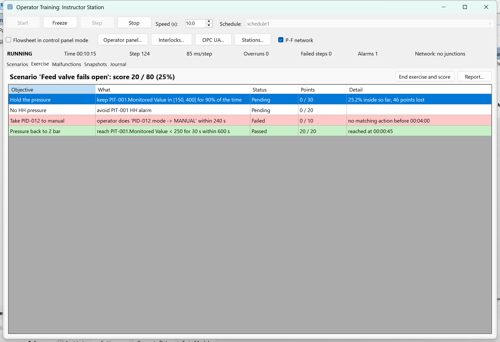

*The Exercise tab during a scenario.*

A few rules make good scenarios. One fault per scenario at first; combine faults only after the trainee handles each alone. Give the trainee a quiet minute before the first fault. Use ramps: a step change is a puzzle, a ramp is a plant. Score what matters: an Avoid on the HH alarm, a KeepInRange on the product specification, an OperatorAction for the procedure step you are teaching. Keep the deadline generous the first time and tighten it in the next scenario.

#### The Operator Panel and faceplates

The trainee never needs to see the flowsheet. The **Operator Panel** is a control-room window built from the plant automatically: one tile per controller, valve, switch, input block and piece of equipment, an alarm banner and a clock. Open it from the Operator Training menu or with **Operator panel...** on the Instructor Station. On a single PC put it on a second monitor; the section on remote stations explains how to run it on the PC of the trainee. The clock shows simulated time and turns amber with FROZEN or STOPPED when the instructor holds the plant.

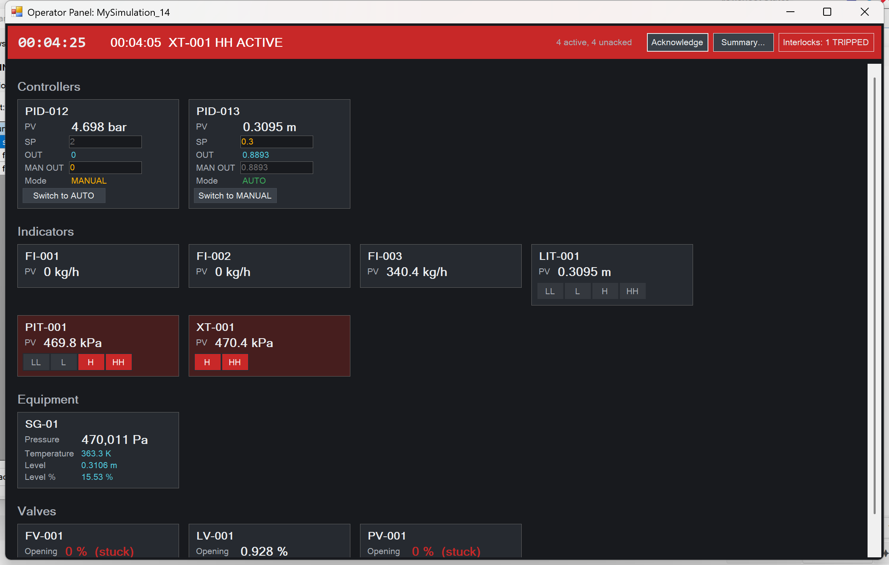

*The Operator Panel during a pressure excursion, with a trip in.*

A controller tile shows PV, SP (type a value and press Enter), OUT, the manual output (editable while the controller is in manual) and the mode, with a button to switch between AUTO and MANUAL; going to manual is bumpless. A valve tile shows the opening (with *stuck* in red when a malfunction has locked the stem), the flow through it, and either a Set entry for a hand valve or a note that a controller drives it. Switch and Input tiles do what the flowsheet blocks do. Equipment tiles are read-only values with one or two actions: a pump has a target speed and Start/Stop buttons, a heater or cooler in fixed-duty mode has a Set duty entry, vessels show pressure, temperature and level, columns show their top and bottom conditions and duties. Gauges show their monitored value in their own units, with the alarm level in red when in alarm. The layout follows the usual recommendations for process HMIs : quiet greys, the process value in bright text, colour reserved for alarms.

Every entry, button and toggle goes through the session as an **operator action**: it is applied at the start of the next step and written to the journal with the trainee wording, so objectives can match on it.

On the operator screens described next, clicking an equipment symbol, an instrument bubble or a button configured for it opens a **faceplate**: a small window with the same tile the panel would show for that object. Faceplates are the usual way to operate from a P&ID-style screen, with the panel kept for an overview.

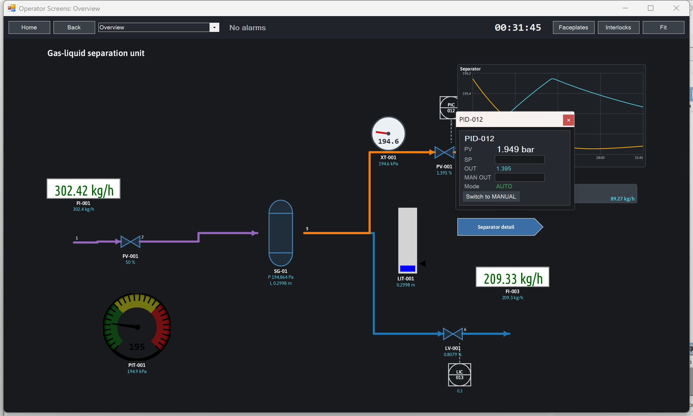

*A controller faceplate opened from its instrument bubble on an operator screen.*

#### Operator Screens

The panel is generated; the **Operator Screens** are designed. They are P&ID-like pages with equipment symbols, pipes that change colour with the stream, instrument bubbles drawn to ISA-5.1 , live values, buttons, trends and flags that jump from one screen to another. Open the **Operator Screens Designer** from the Operator Training menu.

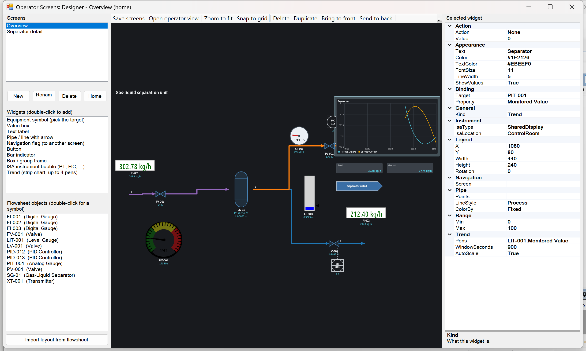

*The Operator Screens Designer with a trend widget selected.*

The designer has a list of screens (one of them marked as Home), a palette of widgets, a list of the flowsheet objects, the canvas (drag to move, handles to resize, wheel to zoom, middle button to pan) and a property grid for the selected widget. **Import layout from flowsheet** builds a first screen from what is on the drawing: an equipment symbol for every unit operation at its flowsheet position, and a pipe for every material stream, already bound to the stream and coloured by phase. From there, delete what the operator does not need and add what a control room shows. **Save screens** stores them in the flowsheet file.

|  |  |
|:---|:---|
| **Widget** | **What it shows or does** |
| Equipment symbol | The flowsheet drawing of the object with up to three live values under it; clicking it in the operator view opens its faceplate. |
| Value box | One property of one object, with units. |
| Text label, box | Static text; a rectangle to group things. |
| Pipe | A polyline with an arrow head. Bound to a material stream it is coloured by phase, temperature, pressure, vapour fraction or mass flow, with the same scales the flowsheet uses; a stream with no flow is drawn dimmed, so a closed valve shows as a dead line. Line styles for process lines, electric signals (dashed), pneumatic signals and software links, as on a P&ID. |
| Navigation flag | A tag-shaped button that opens another screen. |
| Button | An action on an object: open faceplate, pump start or stop, valve open or close, or set a property to a value. |
| Bar indicator | A vertical bar between a minimum and a maximum for one property. |
| ISA instrument bubble | A circle (field instrument), circle in a square (shared display), hexagon (computer) or diamond in a square (PLC), with the location mark and the tag text; bound to a gauge or a transmitter it shows the live value and the alarm level. Bubbles can also stay unbound, as a drawing, so the screen can show the instrumentation the way the plant documents it. |
| Trend | A strip chart of up to four pens over a time window. |

**Open operator view** in the designer, or **Operator Screens** in the menu, opens the trainee side: the home screen with Home and Back buttons, a screen selector, the clock, the alarm line, and buttons for the faceplates panel and the interlock status. Clicking a symbol opens its faceplate, clicking a flag changes screen, clicking a button performs its action and journals it with the button text.

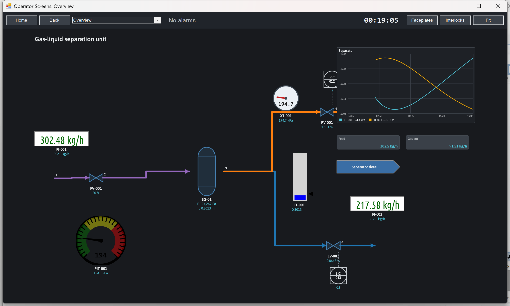

*An overview screen in the operator view, with instrument bubbles, signal lines and a trend.*

#### Alarms

Alarms are how the plant talks to the operator. In the OTS they come from the alarm limits of gauges and transmitters (LL, L, H and HH, each with its own enable box in the object editor), are announced on the panel and on the screens, and live in an **alarm summary** with the acknowledgement discipline of a control room, in the spirit of ISA-18.2 and EEMUA 191 .

The gauge computes its flags every step; the session watches the flags and turns each change into an alarm record and a journal line, for instance *PIT-001 H alarm ACTIVE (value 752.3 kPa)* and later *PIT-001 H alarm cleared*. HH and LL have High priority, H and L have Low priority. An alarm leaves the summary only when it is both back to normal and acknowledged. An alarm that returns to normal before anyone acknowledged it stays listed as *normal, unacked*, so a fleeting excursion is still visible when the trainee comes back.

The banner on the operator panel and the alarm line on the screens show the newest unacknowledged alarm and blink red until everything is acknowledged. **Acknowledge** on the panel acknowledges everything at once. **Summary...** opens the alarm summary, with the time raised, tag, level, priority, value when raised, state, time cleared and time acknowledged; **Acknowledge selected** and **Acknowledge all** do what they say. Each acknowledgement is an operator action in the journal.

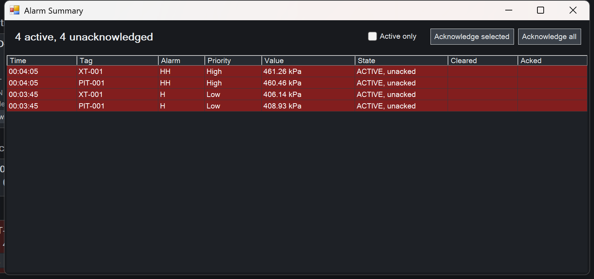

*The alarm summary with H and HH active on two instruments.*

#### Interlocks

A safety instrumented system trips the plant when the operator and the controllers have failed to keep it within limits . The OTS has an interlock engine: trip logic with conditions, a delay, latching, actions that override everything while the trip lasts, bypass, reset and first-out recording. **Interlocks...** on the Instructor Station opens the editor; the same button on the operator panel and the screens opens it in operator mode (status only, no forced reset).

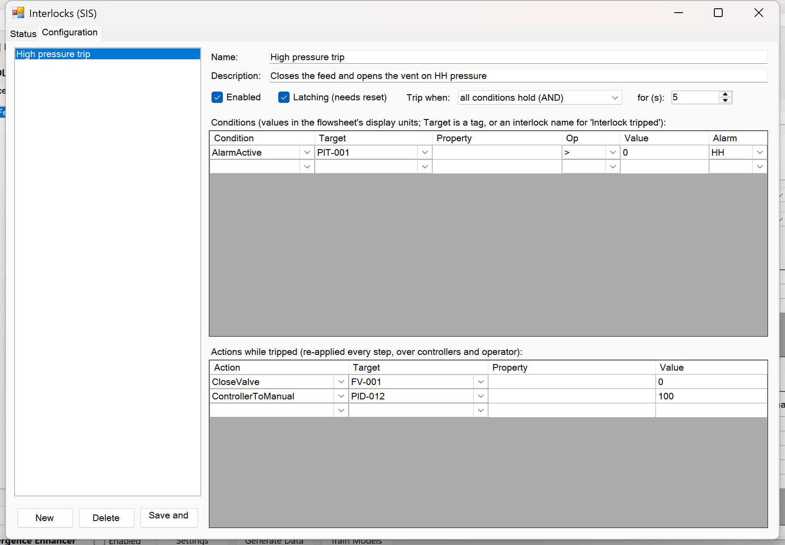

*An interlock in the Configuration tab: one condition, two actions.*

Each interlock has a name, an enabled flag, a latching flag (a latched trip stays tripped until it is reset; an unlatched one clears when its conditions clear), an All/Any rule over its conditions, and a delay: the conditions must hold for that many simulated seconds before the trip. Conditions are of three types: **Compare** (a property of a tag against a value), **Alarm active** (a level of a gauge) and **Interlock tripped** (another interlock, for cascaded trips). Actions are **CloseValve** and **OpenValve** (the valve is driven to 0 % or 100 % and its stem is locked, so controllers and operator cannot move it), **StopPump** (the target speed is held at zero), **ControllerToManual** (with a given output) and **SetProperty** (a property written every step). Actions are reapplied at the start of every step, after the controllers and the operator, so nothing undoes them until the trip is released.

The **Status** tab lists each interlock with its state (normal; conditions met, timing; TRIPPED; bypassed), the time of the trip, the **first-out** condition (the one that completed the trip, with its value) and the actions. **Reset** releases a latched trip and is refused while the conditions still hold, with the refusal journaled together with the first-out. **Force reset** releases it anyway and is only offered to the instructor. **Bypass** keeps the logic evaluating and journaling what it would have done, without acting, for maintenance scenarios. **Trip now** trips by hand for testing.

#### Trends

The session records every pen that any trend widget on any screen asks for, one sample per step, from the moment the session starts (the last 7200 samples per pen: ten hours at a 5 s step). A screen opened later shows the history already recorded. A trend widget draws up to four pens, each scaled to its own range, so a pressure in kPa and a level in metres share one chart without one flattening the other; the width of the time axis is a property of the widget, and the chart fills from the left, then scrolls. Trends are the best tool the trainee has for catching a slow malfunction (a ramped valve failure, a drifting sensor) before the alarm. Put one on the home screen.

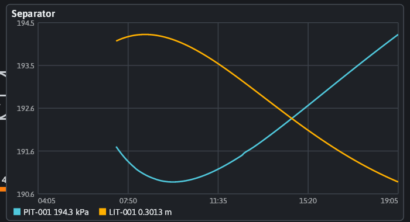

*A trend with the separator pressure and level over fifteen minutes.*

#### The OPC UA server

The session can publish itself as an OPC UA server . Use it to drive a third-party HMI, to log the exercise in a historian, to connect a PLC emulator running real interlock logic, or simply to watch the plant from a client such as UaExpert. **OPC UA...** on the Instructor Station opens the window: choose a port (4840 is the OPC UA default), the security policies to offer (unsecured, or sign and encrypt with Basic256Sha256, or both) and press **Start server**. The first start creates a self-signed certificate under the DWSIM folder of the local application data; later starts reuse it. The window shows the endpoint, the number of tags and the connected client sessions. The server keeps running when the window is closed and stops with DWSIM.

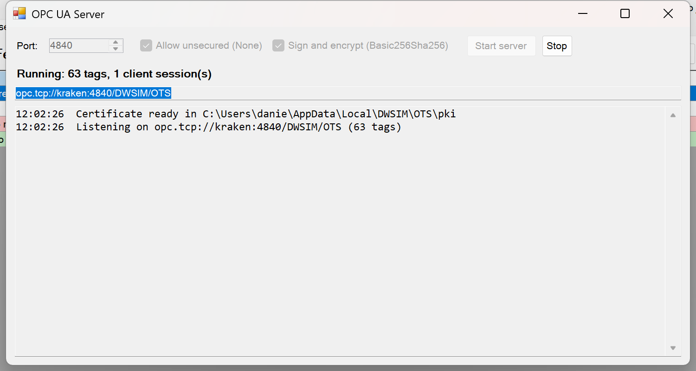

*The OPC UA server window with one client session.*

The address space, under *Objects / DWSIM OTS*, has three folders. **Session** publishes the simulated time, the state, the step, the speed factor (writable), the counts of active and unacknowledged alarms, an acknowledge-all node, the tripped interlocks and the exercise score. **Interlocks** has one folder per interlock with tripped, bypassed (writable), reset and first-out nodes. **Plant** has one folder per tag: PV, SP, OUT, manual and active for a controller (SP, OUT, manual and active writable), the value and the four alarm flags for a gauge or transmitter, the opening and the locked flag for a valve (opening writable when no controller drives it), the state of a switch, the speed and target speed of a pump, the duty of a heater or cooler, the pressure, level and temperature of a vessel. Values are in the display units of the flowsheet and refresh twice a second. Every write is queued as an operator action, applied at the next step and journaled as *OPC UA write*, so objectives and the report see OPC clients as they see the trainee.

#### Instructor and operator on separate PCs

On a single PC the instructor and the trainee share the screen and the mouse. A training bench separates them: the DWSIM of the instructor runs the plant, and one or more **operator stations**, each a DWSIM of its own on any PC of the network, mirror the session and send the actions of the trainee back. Nothing else is needed: no shared database, no administrator rights, only one open TCP port from the station to the instructor PC (4850 by default). Both DWSIMs need the level 3 subscription.

**Stations...** on the Instructor Station opens the server window: choose the port, press **Start**, and the window lists the addresses to which stations can connect and, as they arrive, each station with its name, address, frames sent and commands received. **Launch an operator station on this PC** starts a second DWSIM with the same file, instructed to connect back automatically: useful for a second monitor, or to test the set-up before the second PC arrives.

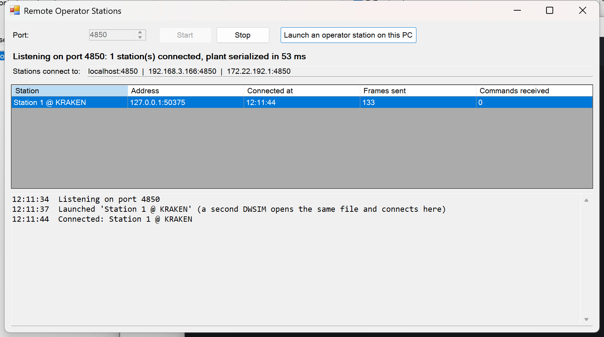

*The Stations window with one connected station.*

On the trainee PC, open the same flowsheet file (a shared folder or a copy; the objects must be the same, screens and interlocks come from the instructor), choose **Operator Station (Remote)** in the Operator Training menu, enter the address of the instructor PC, the port and a station name, and press **Connect**. The operator panel opens, and the screens if the file has any. The window stays as a monitor of the link, with the frames received and the age of the last frame.

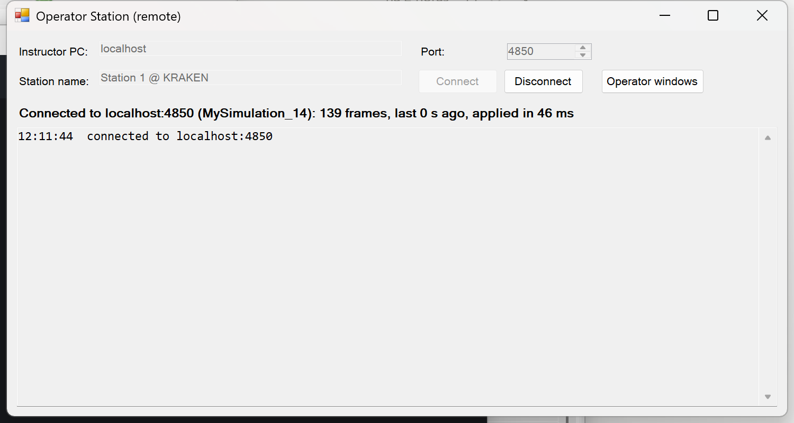

*The station side of the link.*

A station keeps a local copy of the plant in sync with the instructor: each frame carries the whole process state, compressed, and the station loads it into its own objects, so its panel, screens, faceplates, alarm summary, interlock status and trends all work exactly as on the instructor PC. Everything the trainee does travels back as a command, is applied by the session of the instructor and is journaled with the station name. Start, Freeze and Stop, malfunctions, scenarios, snapshots, the screens designer, the interlock configuration and the forced reset stay with the instructor. The frames are throttled so that serialising the plant costs the instructor at most a fifth of the step time; a station shows the plant with a delay of one frame, and commands are applied at the next step of the instructor.

#### The pressure-flow network solver

The dynamic mode of DWSIM decides flows valve by valve. That works while every valve sits between two things that know their pressure. Where two valves meet with nothing between them, or where valves feed a mixer or drain a splitter, the pressure in between has no owner: each valve computes its flow from a different assumption and mass is not conserved between them. Physically the middle pressure is the one that makes the flows equal, which is a small algebraic problem: one unknown pressure per junction, one mass balance per junction. This is the same idea as the nodal formulation used for pipe networks , applied to a handful of streams.

Before every step, after malfunctions and interlocks have set the valve openings, the OTS finds the junctions (the streams around each mixer and splitter, and each stream between two Kv valves, grouped into sets that share one pressure; a junction that touches a holdup or a pressure-specified boundary takes that pressure), writes the mass balance of each unknown junction with the flow equations of the valves themselves , and solves the pressures by Newton iterations with a bisection sweep as a fallback. The holdup pressures at the fixed ends are extrapolated from the previous step, and the junction streams are re-flashed at the solved pressure with the solve repeated once, because the flow of a valve depends on the phase split at its inlet. The pressures are then written to the junction streams and the step runs as usual.

The **P-F network** checkbox on the Instructor Station turns the solver on (the default) or off. The status line shows the number of junctions, the iterations and the time of the last solve, and *NOT CONVERGED* if it failed; at Start the journal lists what was found and which junctions could not be solved (fed by nothing through a valve, or with two anchors), which are left as specified. Only valves in a Kv mode are flow elements; pipes, orifice plates and relief valves keep their own dynamic models and are treated as pressure holders. There is no reverse flow, and a junction fed directly by a holdup with no valve has no equation for that flow, so put a valve on every holdup outlet. On a plant where every valve sits between a holdup and a header there are no junctions and the solver does nothing.

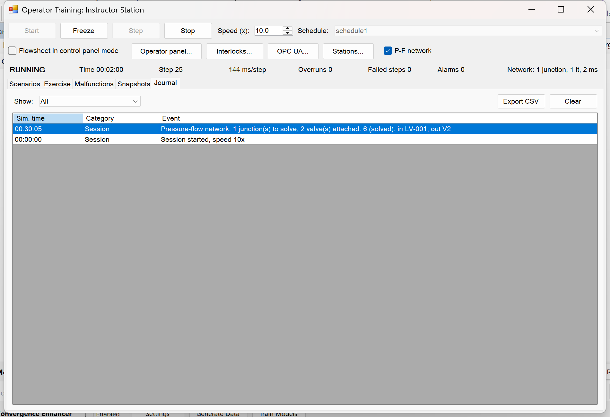

*One junction solved every step, reported in the status line and the journal.*

#### Running a training course

Everything above is equipment. A course is a sequence of sessions of 45 to 60 minutes each: about ten minutes of briefing, twenty-five of exercise at two to five times real time, and fifteen of debriefing over the journal and the report. Start with one or two sessions without any fault, so the trainee learns what normal looks like: a trainee who has not seen the plant behave normally cannot recognise it behaving abnormally. Then one fault per session, ordered by difficulty (a sticking valve, a lying instrument, a feed upset, a trip), and finally an unannounced, scored assessment.

Before the trainee arrives, open the file and the Instructor Station, load the scenario, start the stations server and connect the trainee station. In the briefing, tell the trainee what the plant is, what normal looks like, what the alarm limits are and what the trip does; do not tell them the fault. During the exercise, speak little and watch the Exercise tab and the journal; freeze to ask what they see, backtrack to undo an error worth discussing, and add faults by hand if they are ahead of the plan. In the debriefing, end the exercise and score it, open the report, and walk the timeline together: every alarm, every action and the time between them. The simulated times of the journal turn *you had ninety seconds between the H alarm and the HH alarm* into a measured fact.

When you design exercises for your own plant: model first and run it for an hour of simulated time without faults; instrument it with a gauge for every variable the operator watches and transmitters on the ones that fail in real life; build one overview screen and one detail screen per unit, each with a trend; transcribe the cause-and-effect matrix of the plant into interlocks and test each with Trip now; write one scenario per fault, scoring both the outcome (Avoid, KeepInRange) and the procedure (OperatorAction); and play every scenario yourself on a station before a trainee sees it. A fault that trips the plant before the trainee can react teaches nothing.

