# Methane Steam Reforming

#### Introduction

This tutorial is based on the document entitled ”Simulation of a Methane Steam Reforming Reactor”, which can be found [here](http://www.chem.mtu.edu/~jmkeith/fuel_cell_curriculum/kinetics/module8/ALL.doc).

It demonstrates how to build a simulation model that predicts methane conversion and hydrogen yield in a catalytic steam reforming reactor.

#### Background

Natural gas is widely used as a hydrogen source for fuel-cell and industrial applications because of the existing distribution infrastructure. In steam reforming, natural gas (primarily methane) reacts with steam over a catalyst to produce a synthesis gas (syngas) rich in hydrogen and carbon monoxide, with carbon dioxide as a by-product. Excess unreacted steam is typically present in the reformate stream.

The steam reforming reaction is given as:

CH4 + H2O ↔ 3 H2 + CO (1)

In the steam reformer, the water gas shift reaction also takes place as:

CO + H2O ↔ H2 + CO2 (2)

Adding together the steam reforming and water gas shift reactions gives the overall reaction:

CH4 + 2 H2O ↔ 4 H2 + CO2 (3)

The equilibrium constants can be expressed in terms of partial pressures (in atm) and temperature in degrees Kelvin. The subscript on the following equilibrium constants refers to the equation number given above:

image

In the reactor, methane (CH4) and water (H2O) are fed as reactants and carbon dioxide (CO2), carbon monoxide (CO), and hydrogen (H2) are produced over a nickel catalyst on an alumina support.

In laboratory experiments, a nonreacting inert gas such as helium (He) may also be present. In the most general form, the governing conservation equations for each of these species is given below, where ***Fi*** denotes the molar flow rate of species i in mol/h, ***W*** denotes the catalyst weight in g, and ***Ri*** denotes the reaction rate of equation i in units of mol/(g-h):

image

The reaction rates are given by:

image

Furthermore, the coefficients in the equations above are given by the Arrhenius relationships as:

image

Note that in the above expressions, R = 8.314 J/(mol-K) is the gas constant.

#### Problem Statement

Consider a feed of 10000 mol/h CH4, 10000 mol/h H2O, and 100 mol/h H2 to a steam reforming reactor that operates at 1000 K and a 1 atm feed pressure. Determine the overall methane conversion as a function of catalyst weight up to 382 g.

The overall methane conversion as found on the original reference is equal to **76%**. We’ll try to obtain the same result in DWSIM.

#### DWSIM Model (Classic UI)

1.  Create a New Steady-State Simulation. Close the Simulation Wizard.

    > 
    >
    > | *image* | *Remember to* **Save your simulation at the end of each step.** |
    > |:---|:--:|

2.  Go to **Edit** \> **Simulation Settings** \> **Compounds**, and select Methane, Hydrogen, Water, Carbon Monoxide and Carbon Dioxide to add these compounds to the simulation. Add Methane before Water: the reaction rate expressions refer to the reactants and products by their position in the compound list.

    

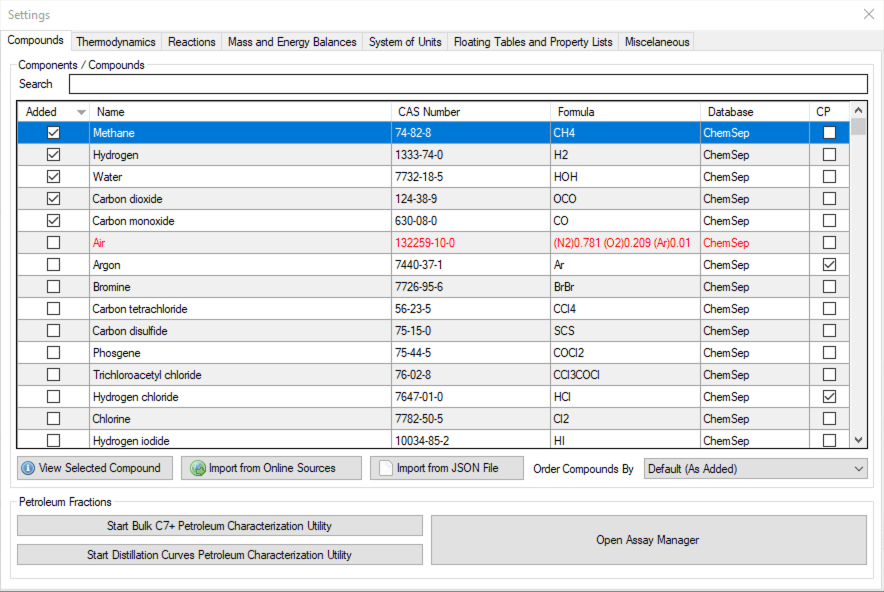

*Compound Selection*

3.  Go to **Thermodynamics** tab, select **Peng-Robinson (PR)** in the property package list; DWSIM adds it to the simulation right away, and it appears under **Added Property Packages**.

    

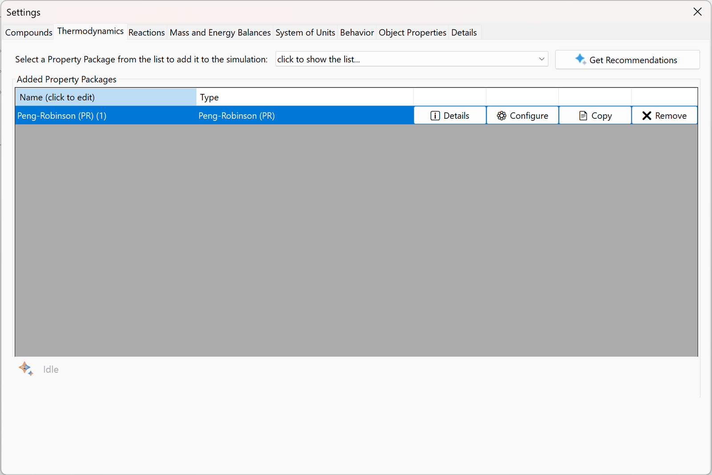

*Property Package Selection*

4.  Go to the **System of Units** tab and create a new System of Units, with the following setup:

    

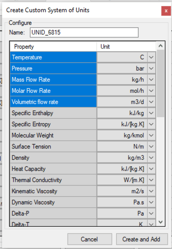

*New System of Units*

5.  After creating this Units Set, select it on the System of Units combobox.

6.  Go to **Reactions** and create three Heterogeneous Catalytic reactions, with the following configuration (Basis: Partial Pressures, Phase: Vapor, Amount Units: atm, Rate Units: kmol/\[kg.h\]; the numerators are shown in the figures). Each reaction has its own denominator: the variables R1, R2 (reactants) and P1, P2 (products) are numbered in the order of the compounds in the list, and a compound that does not take part in a reaction has no variable, so its adsorption term is left out. The figures cut the denominators short; type them as follows. Overall Reaction: (1+6.65E-4\*exp(38280/8.314/T)\*R1+1.77E+5\*exp(-88680/8.314/T)\*R2/P1+6.12E-9\*exp(82900/8.314/T)\*P1)^2. Steam Reforming: (1+8.23E-5\*exp(70650/8.314/T)\*P2+6.65E-4\*exp(38280/8.314/T)\*R1+1.77E+5\*exp(-88680/8.314/T)\*R2/P1+6.12E-9\*exp(82900/8.314/T)\*P1)^2. Water Gas Shift: **(1+1.77E+5\*exp(-88680/8.314/T)\*R1/P1+6.12E-9\*exp(82900/8.314/T)\*P1+8.23E-5\*exp(70650/8.314/T)\*R2)^2**

    

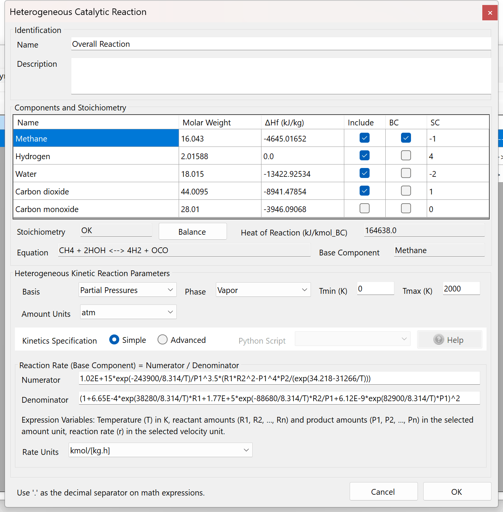

*Overall Reaction setup*

    

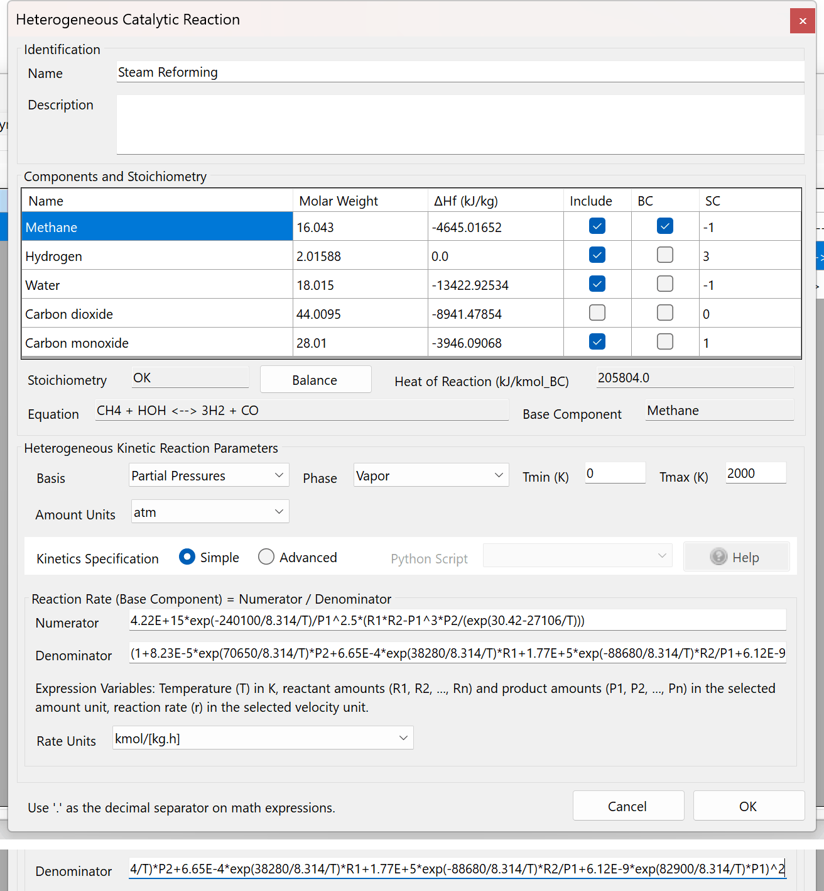

*Steam Reforming Reaction setup*

    

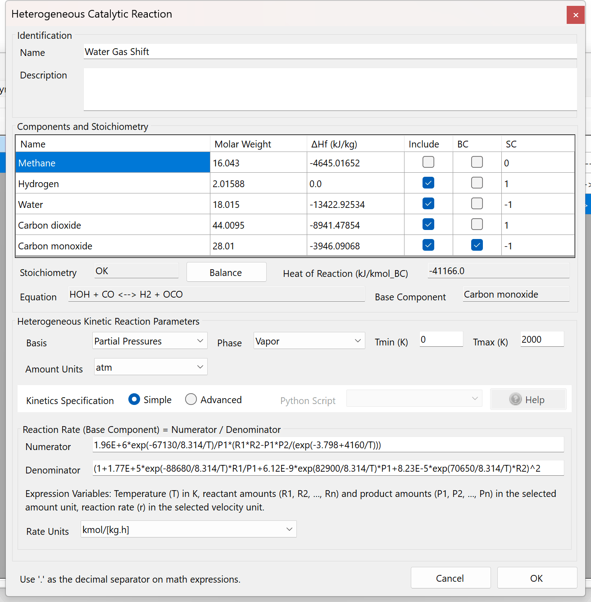

*Water Gas Shift Reaction setup*

7.  Close the Settings panel, and drag two material streams, one energy stream and one PFR to the Flowsheet PFD. Connect the streams to the PFR as shown on the following figure:

    

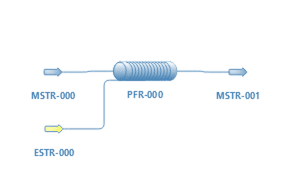

*PFD setup*

8.  Configure the inlet stream (MSTR-000) as follows: temperature 726.85 C (1000 K), pressure 1.01325 bar (1 atm), and the compound amounts on the Compound Amounts tab with Basis set to Mole Flows (click Accept Changes):

    

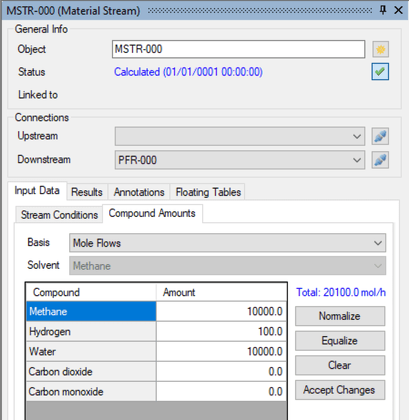

*Inlet Stream setup*

9.  Configure the PFR as follows. On the General tab, set the Calculation Mode to Isothermic. Keep the defaults of the Dimensions tab (Reactive Volume 1 m3, Tube Length 1 m). On the Catalyst Info tab, enter a Catalyst Loading of 0.386 kg/m3, a Catalyst Particle Diameter of 2 mm and a Catalyst Void Fraction of 0.4. The catalyst weight is the Catalyst Loading times the Reactive Volume, 0.386 kg, close to the 382 g of the problem statement:

    

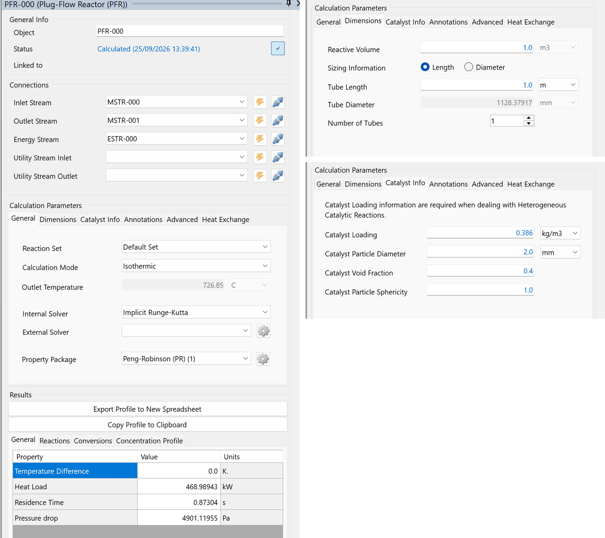

*PFR setup*

10. **Note:** when you create new reactions, they are automatically added to the **Default Reaction Set**. When you add new reactors to the flowsheet, they are automatically configured to use all supported and active reactions on the Default Reaction Set. You can create, edit and remove Reaction Sets at any time, and associate the individual reactors with different Reactions Sets too.

11. Run the simulation (press F5 or click on the Solve button on the toolbar). Wait for the calculation to finish.

12. Once finished, you should get the following results (methane conversion ~ **76.1%**):

    

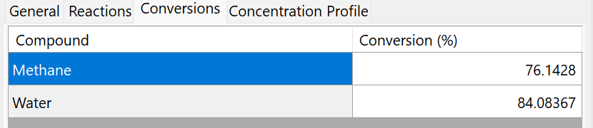

*Final Methane conversion*

13. Create a new Sensitivity Analysis case to study the influence of the temperature on Methane conversion from 700 to 1000 C. Go to **Flowsheet Analysis** \> **Sensitivity Analysis** and click on **New Case**.

14. Set up the Independent Variable (MSTR-000, Temperature, Lower Limit 700, Upper Limit 1000, 5 points) and the Dependent Variable (PFR-000, Methane: Conversion) as follows:

    

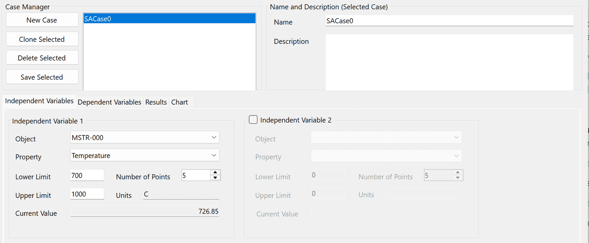

*Sensitivity Analysis case setup*

15. Go to the Results tab and click Start Sensitivity Analysis. Wait for the calculations to finish.

16. Once finished, click on **Send Data to New Worksheet**.

    

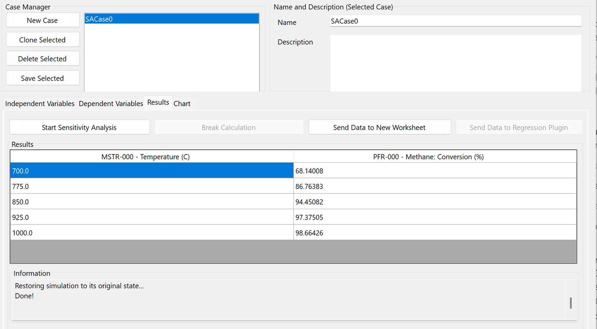

*Analysis results*

17. With the data range selected on the spreadsheet, right-click on it and select **Create 2D XY Chart from Selection**.

    

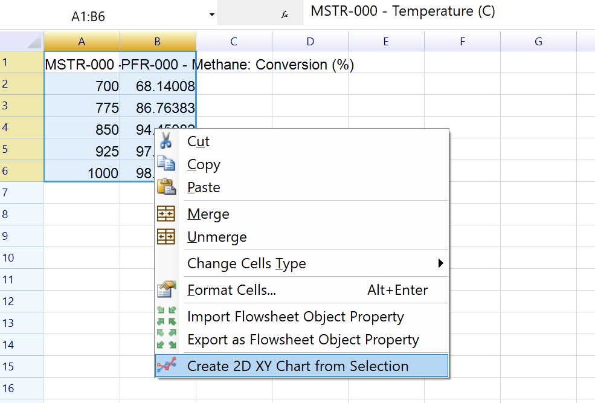

*Create Chart from Spreadsheet Range*

    

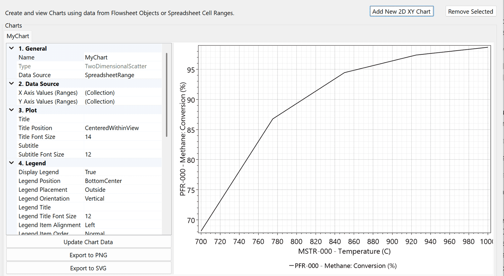

*Created Chart*

18. You can also view the concentration profile of the PFR using the Charts utility. Go to the Charts tab of the flowsheet window and click on **Add New 2D XY Chart**, in the chart properties set Data Source to FlowsheetObject and Source Object to PFR-000, select *Concentration Profile* as the **Chart Type** and click on **Update Chart Data:**

    

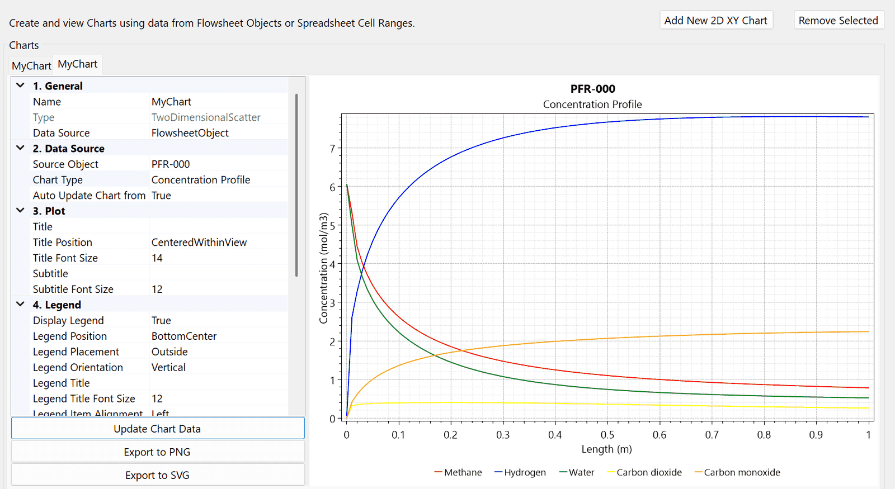

*PFR concentration profile*

