# Pressure-Swing Distillation

#### Introduction

This simulation is an example of Pressure Swing Azeotropic Distillation. Test case taken from COCO Simulator ([link](http://www.cocosimulator.org/down.php?dl=CScasebook_MA.fsd)) (original author: Harry Kooijman - [www.chemsep.org](http://www.chemsep.org)). Adapted from the pressure-swing flowsheet in W. L. Luyben, Comparison of Extractive Distillation and Pressure-Swing Distillation for Acetone-Methanol Separation, Ind. Eng. Chem. Res. (2008) 47 pp. 2696-2707, doi:10.1021/ie701695u.

#### Background

Methanol and acetone form a minimum temperature azeotrope but the composition of this azeotrope is sensitive to the pressure. We can make use of this to separate the two components into pure products by operating two columns at different pressures.

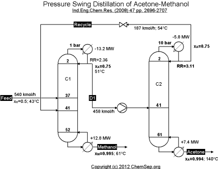

*Process Flowsheet.*

#### DWSIM Model (Classic UI)

1.  Create a New Steady-State Simulation. Close the Simulation Wizard.

    > 
    >
    > | *image* | *Remember to* **Save your simulation at the end of each step.** |
    > |:---|:--:|

2.  Go to **Edit** \> **Simulation Settings** \> **Compounds**, and select Methanol and Acetone to add these compounds to the simulation.

    

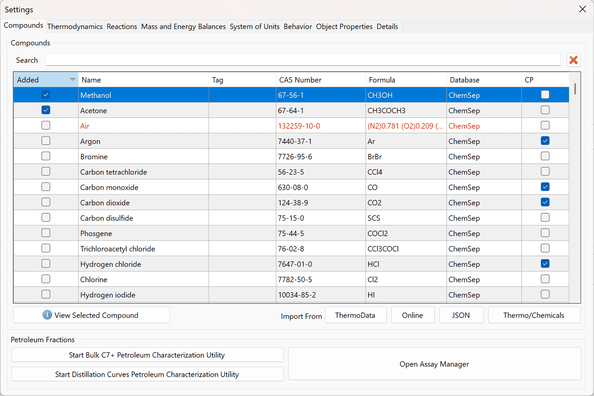

*Compound Selection*

3.  Go to **Thermodynamics** tab, select **NRTL** in the list at the top of the tab (Select a Property Package from the list to add it to the simulation). DWSIM adds it at once to the Added Property Packages grid, as **NRTL (1)**. Click Copy on its row to add a second copy, then click the name of the copy and rename it to **NRTL (Inside-Out)** on the Added Property Packages grid, then click **Configure** on it and, on the **Equilibrium Calculation Settings** tab, set **Numerical Method** to **Inside-Out**. The flash algorithm is a setting of the property package, so a second copy is what allows one part of the flowsheet to use a different one.

    

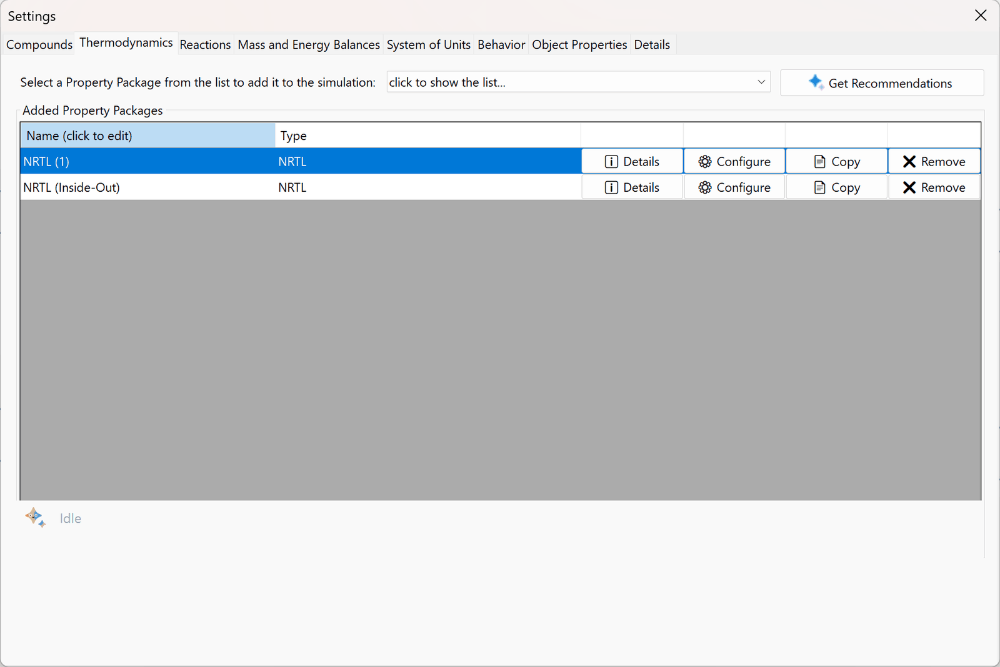

*Property Package Selection*

4.  Check if the NRTL Interaction Parameters are all set (click on **Configure** on the Added Property Packages section).

    

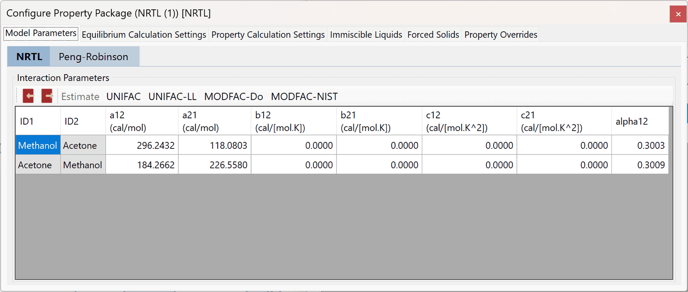

*NRTL Interaction Parameters for Methanol/Acetone*

5.  Go to the **System of Units** tab and create a new System of Units, with the following setup (click Create New..., enter a name, choose the units and click Create and Add). The units that matter here are C for Temperature, bar for Pressure, kmol/h for Molar Flow Rate and MW for Energy Flow, so the duties come out in the units of the original problem:

    

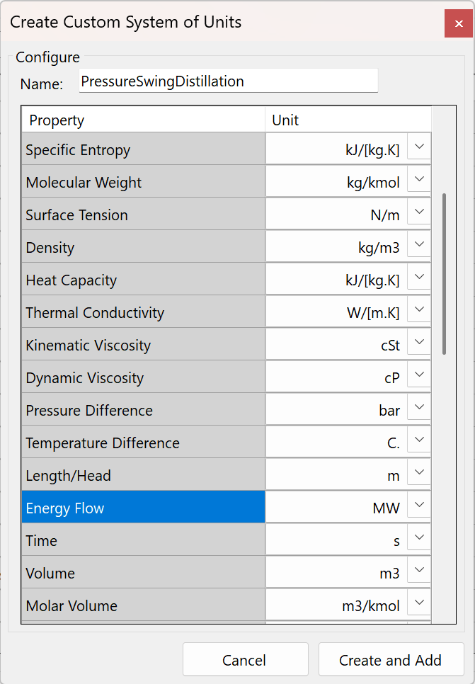

*New System of Units*

6.  After creating this Units Set, select it on the System of Units combobox.

7.  Add the objects to the flowsheet (streams, pump, valve, recycle and distillation columns) as depicted on the following figure, renaming them as required. You’ll setup the connections between them later on this tutorial.

    

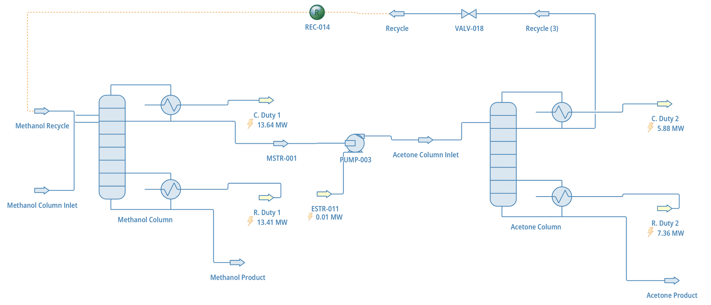

*Process Flowsheet Diagram*

8.  Disable automatic calculation of the flowsheet.

    

*Enable/Disable Flowsheet Calculator/Solver*

9.  Setup the columns and their connections as follows:

    1.  Methanol Column: on the General tab, 52 stages, Steady-State Column Solver Wang-Henke (Bubble Point), Maximum Number of Iterations 1000, Condenser/Top Pressure 1.01325 bar and Column Pressure Drop 0; on the Specifications tab, a Total condenser with Reflux Ratio 2.36 and a reboiler with Product Molar Flow 269 kmol/h; on the Connections tab, Methanol Column Inlet fed to Stage37, Methanol Recycle fed to Stage41, MSTR-001 as distillate, Methanol Product as bottoms, C. Duty 1 and R. Duty 1 as condenser and reboiler duties. This column needs about 140 iterations once the recycle approaches its final composition, so keep the limit well above the default of 100.

        

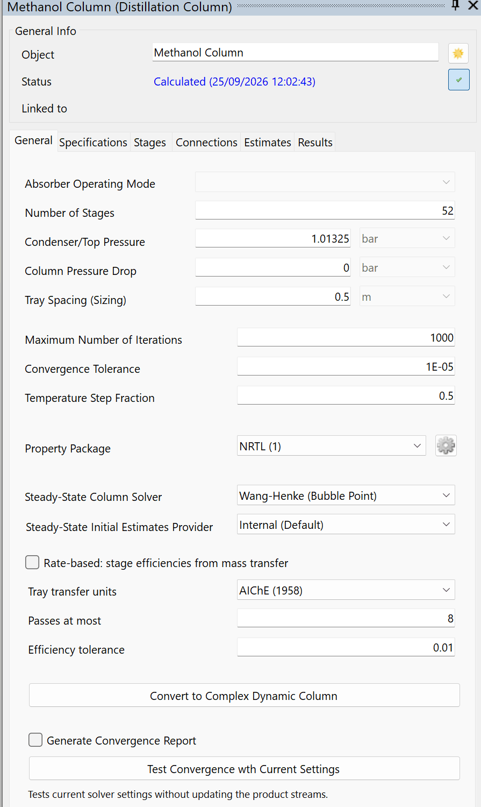

*Methanol Column configuration*

    2.  Acetone Column: 61 stages, Wang-Henke (Bubble Point), Maximum Number of Iterations 1000, Condenser/Top Pressure 10 bar and Column Pressure Drop 0; a Total condenser with Reflux Ratio 3.11 and a reboiler with Product Molar Flow 271 kmol/h; Acetone Column Inlet fed to Stage41, Recycle (3) as distillate, Acetone Product as bottoms, C. Duty 2 and R. Duty 2 as condenser and reboiler duties.

        

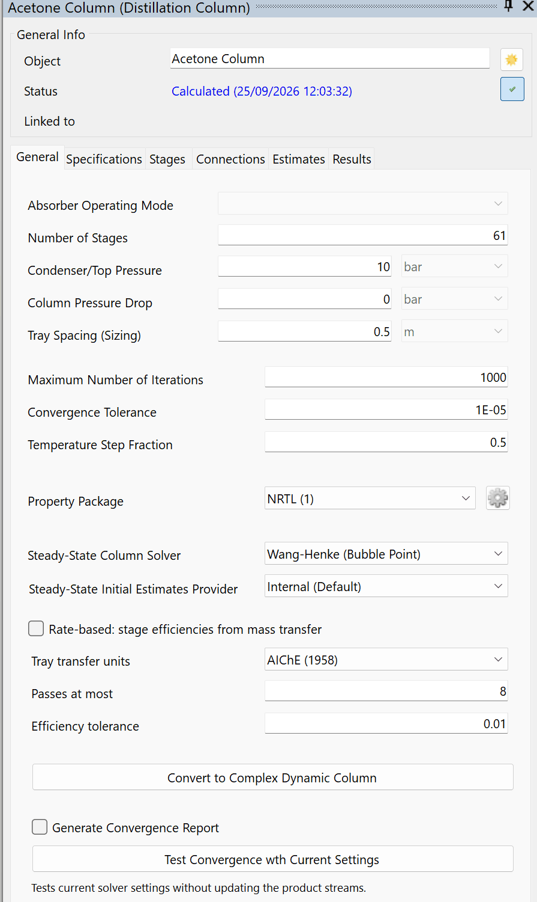

*Acetone Column configuration*

10. On the Estimates tab of the Acetone Column editor, enter initial estimates for the temperature profile, and check the **Temperatures** checkbox so DWSIM can use them. Insert only the boundary values (133 C for the condenser and 142 C for the reboiler, close to the solution at 10 bar) and click the button **Interpolate Temperature (empty cells)** to calculate the inner stage values.

    

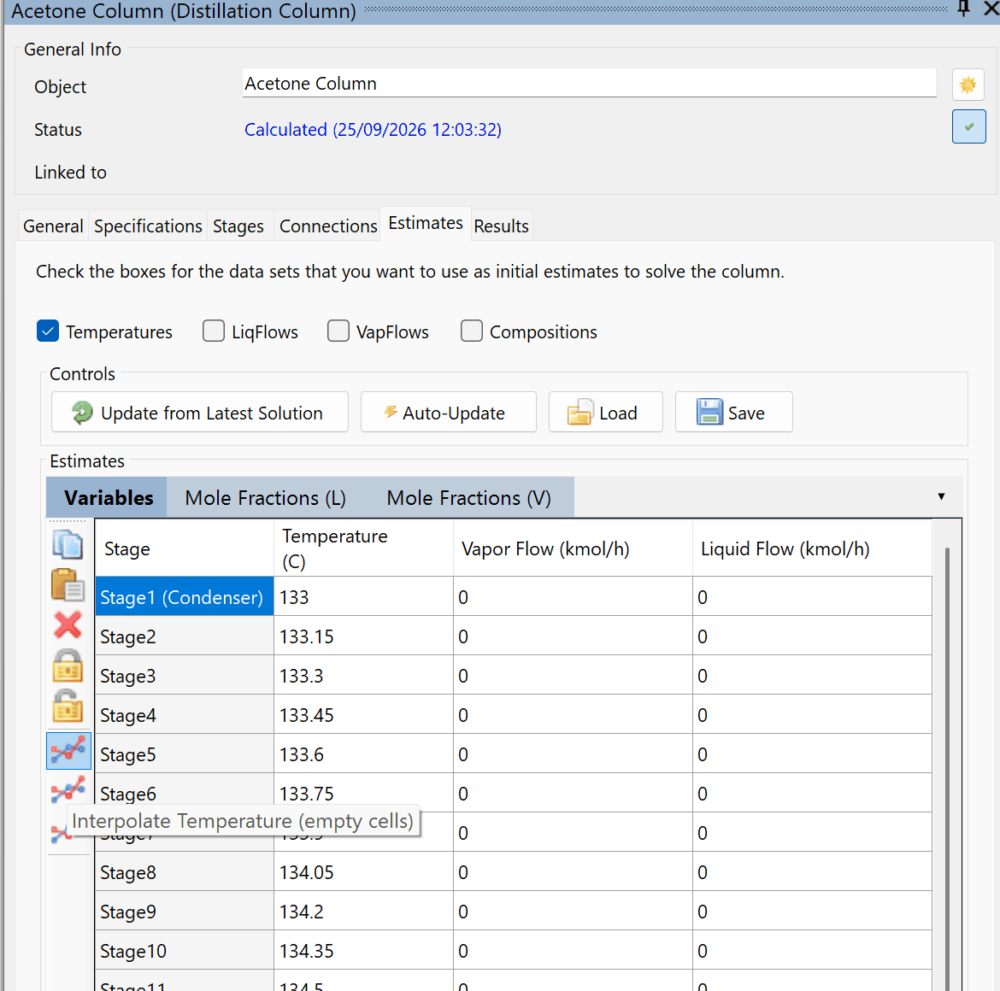

*Acetone Column initial estimates for temperature profile*

11. After the columns are correctly configured and connected to their associated streams, setup the pump, valve and recycle connections using their Editor Panels.

12. Setup the pump and valve properties as follows: PUMP-003 with Calculation Type Outlet Pressure, 10 bar, Efficiency 75 % and ESTR-011 as Energy Stream; VALV-018 with Calculation Type Outlet Pressure, 1.0325 bar.

    

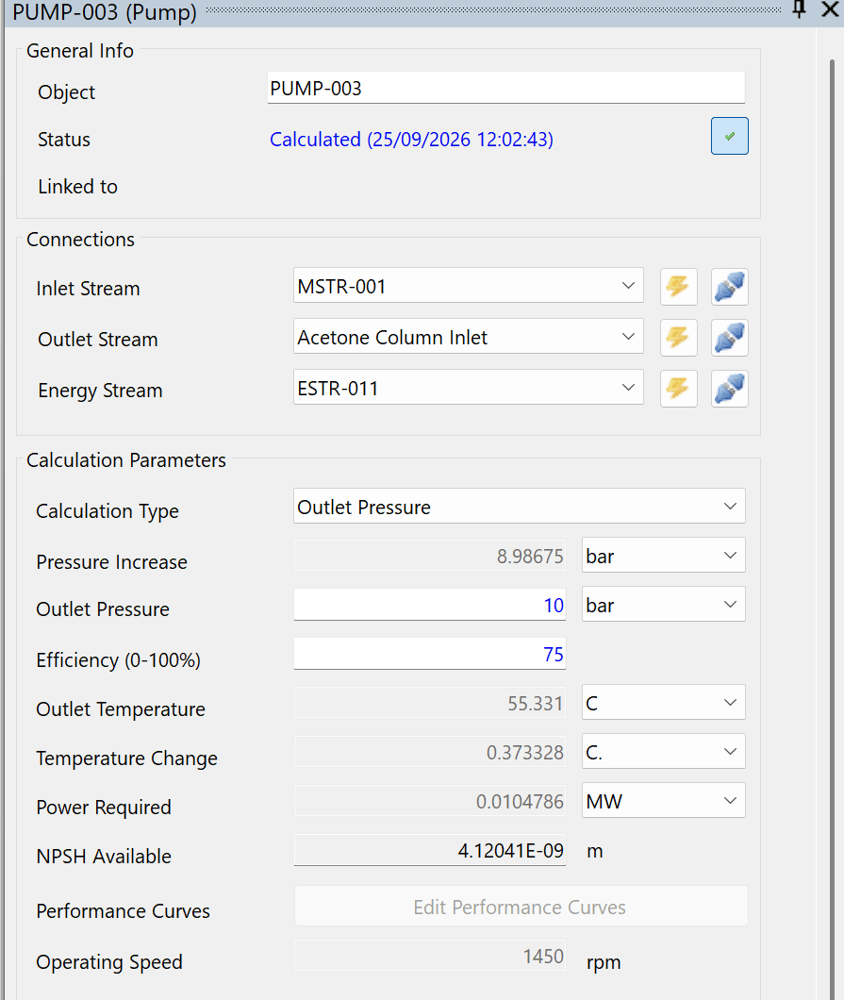

*Pump and Valve properties*

13. Configure the Methanol Column Inlet stream as follows: 43 C, 1.01325 bar, 540 kmol/h, mole fractions 0.5 methanol and 0.5 acetone.

    

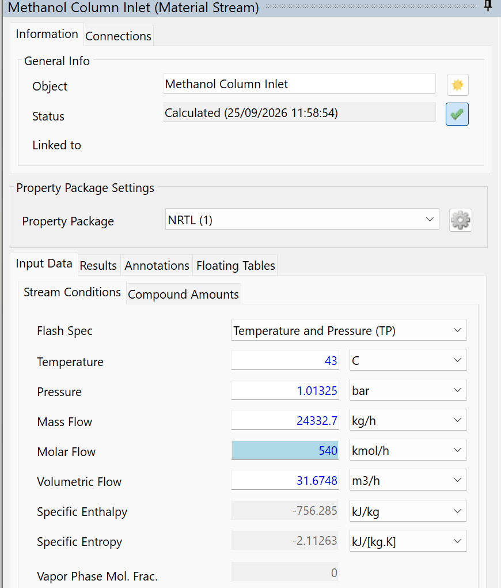

*Methanol Inlet Stream configuration*

14. Configure the Methanol Recycle stream (initial estimates for the recycle) as follows: 54 C, 1.01325 bar, 187 kmol/h, mole fractions 0.61 methanol and 0.39 acetone. Start from a composition close to the final one: with pure methanol, as in older versions of this tutorial, the first pass sends a feed to the Acetone Column that it takes hours to solve.

    

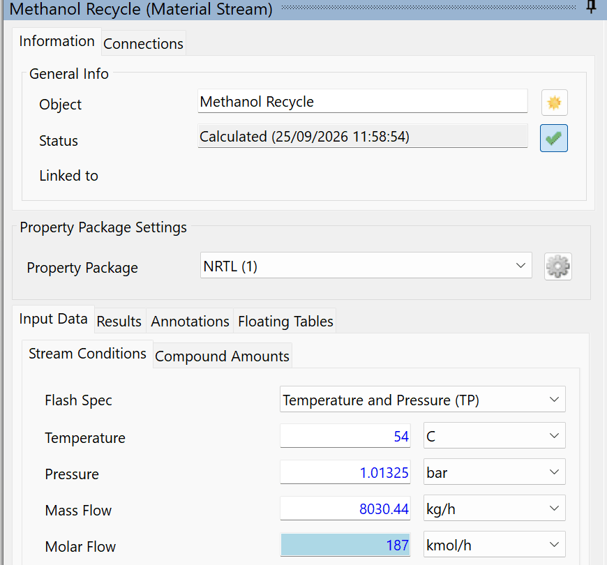

*Methanol Recycle Stream configuration*

15. Assign the **NRTL (Inside-Out)** property package to the following streams, on the **Property Package Settings** section of each one’s editor: **MSTR-001**, **Methanol Product**, **Acetone Product** and **Recycle (3)**. Older versions needed this to avoid PH flash errors; DWSIM 10.2.10 also solves the case with NRTL on every stream and gives the same results, so this step now only shows how a stream can use its own property package.

    

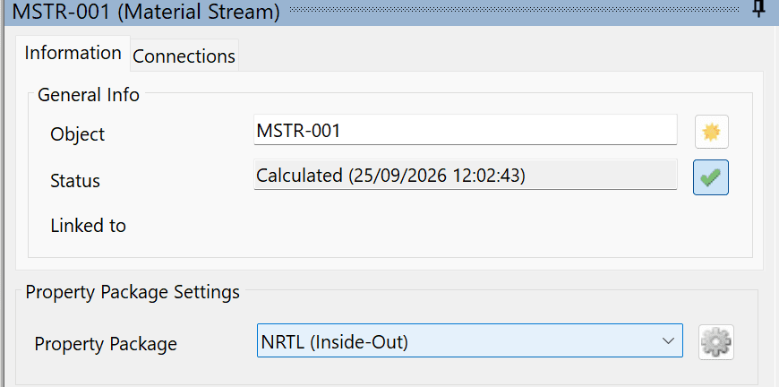

*Assigning the Inside-Out property package to the streams*

16. Re-enable the solver (press F6) and calculate the flowsheet (press F5). Wait for the recycle to converge. It takes two recycle passes and a few seconds.

17. After the flowsheet solves, insert a new Property Table:

    

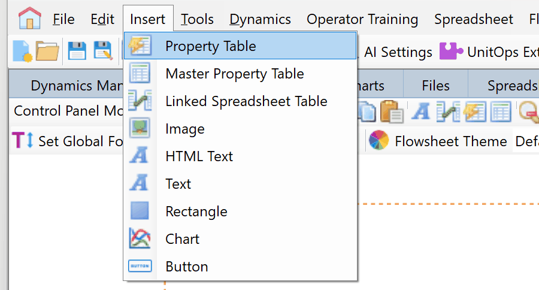

*Inserting a Property Table*

18. Double-click on the inserted table, search for the column energy streams and select Energy Flow for all of them, so these values can be shown on the Property Table.

    

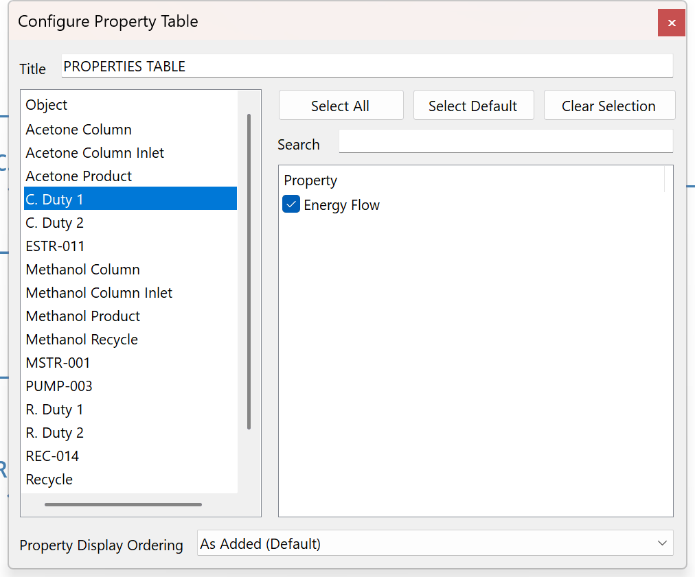

*Setting up a Property Table*

19. Compare the results obtained with the duties specified in the original problem.

    

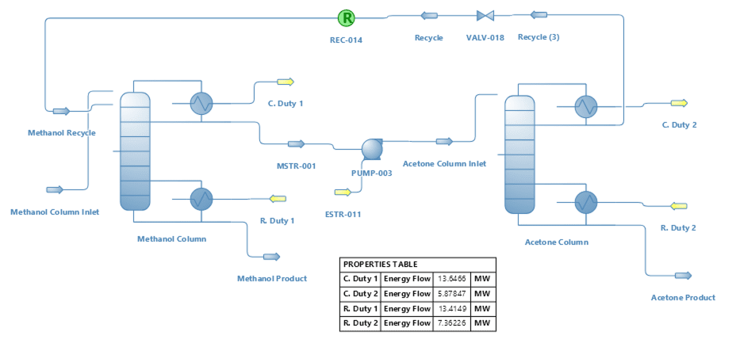

*Final results*

