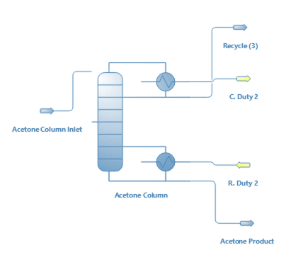
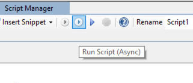
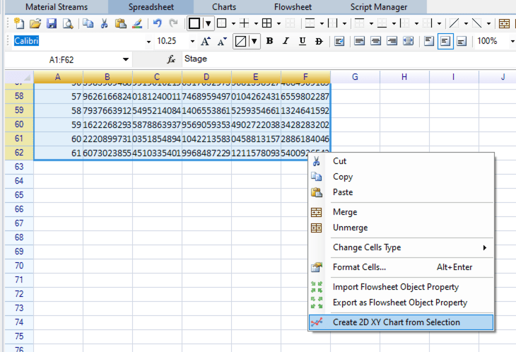
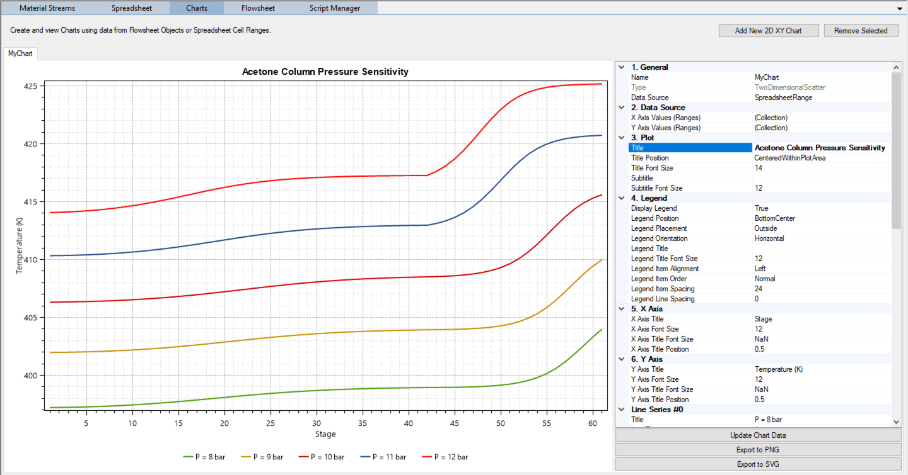

# Flowsheet Control with Python Scripts

#### Introduction

Let us study the effect of the pressure on the temperature profile of the Acetone Column created on the previous tutorial. We will use the **IronPython Scripting**, **Spreadsheet** and **Charts** features available in DWSIM to generate, organize and analyze the results.

#### DWSIM Model (Classic UI)

1.  Save the previous simulation with a different file name and remove everything from the flowsheet except the objects depicted on the following picture:

    

*Process Flowsheet Diagram*

2.  Go to the **Script Manager**, click New on its toolbar to create a script (leave its interpreter at IronPython) and enter the following script:

        # Get Acetone Column object reference from the Flowsheet
        column = Flowsheet.GetFlowsheetSimulationObject("Acetone Column")

        # define the list of column pressures in bar
        Plevels = [8, 9, 10, 11, 12]

        # setup spreadsheet table headers
        Spreadsheet.Worksheets[0].Cells["A1"].Data = "Stage"
        Spreadsheet.Worksheets[0].Cells["B1"].Data = "P = 8 bar"
        Spreadsheet.Worksheets[0].Cells["C1"].Data = "P = 9 bar"
        Spreadsheet.Worksheets[0].Cells["D1"].Data = "P = 10 bar"
        Spreadsheet.Worksheets[0].Cells["E1"].Data = "P = 11 bar"
        Spreadsheet.Worksheets[0].Cells["F1"].Data = "P = 12 bar"

        # add column of stage numbers
        j = 1
        for stage in column.Stages:
            Spreadsheet.Worksheets[0].Cells[j, 0].Data = j
            j += 1

        # loop through the pressure values, set them and run the simulation, collecting the results
        i = 1
        for Pnew in Plevels:
            for stage in column.Stages:
                stage.P = Pnew * 100000 # set new stage pressures in Pa
            Flowsheet.SolveFlowsheet2() # request a flowsheet calculation
            j = 1
            for t in column.Tf: # column.Tf is the vector of final stage temperatures in K
                Spreadsheet.Worksheets[0].Cells[j, i].Data = t # write the temperature values in the corresponding column
                j += 1
            i += 1

3.  Run the script asynchronously with the Run Script (Async) button, or F5 (this keeps DWSIM responsive while the column is solved at the five pressures, which takes a few minutes; the script writes each temperature column to the Spreadsheet as soon as that solve ends):

    

*Run Python Script (Async)*

4.  Go to the **Spreadsheet**, select the data range A1:F62 (the stage numbers and the five temperature columns, with their headers), click with the right mouse button and select **Create 2D XY Chart from Selection**.

    

*Create new chart from selected spreadsheet data range*

5.  Open the new chart on the Charts tab and, in its property grid, set Title (3. Plot) to Acetone Column Pressure Sensitivity and Y Axis Title (6. Y Axis) to Temperature (K). The X axis title (Stage) and the series names come from the spreadsheet headers. The chart should look like the following picture:

    

*Pressure-Temperature dependence of the Acetone Column*

6.  Analyze the results obtained and discuss them with your colleagues.

The temperatures are in K. At 8 bar the profile runs from about 397 K at the top (Stage 1, the condenser) to 404 K at the reboiler (Stage 61), and every bar more raises the whole profile by 4 to 6 K, up to 414 K and 425 K at 12 bar. Above the feed stage the profile is almost flat, since the upper section holds the high-pressure azeotrope; below it the temperature rises quickly towards the boiling point of pure acetone at the column pressure.

