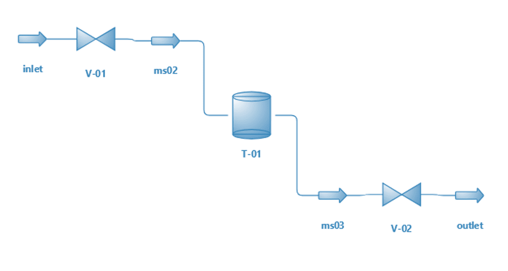
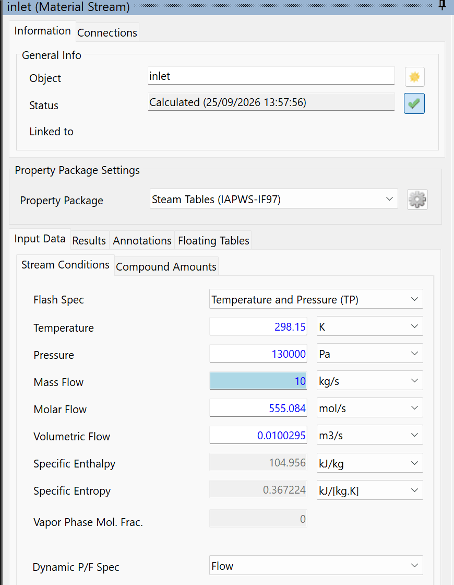
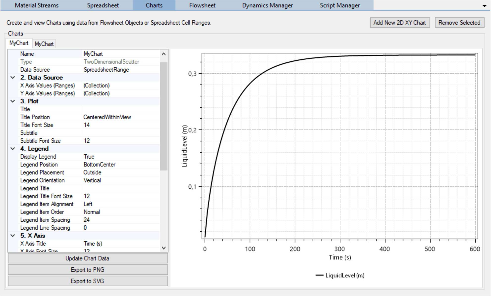
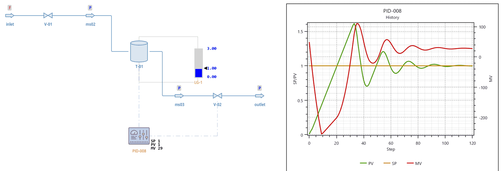
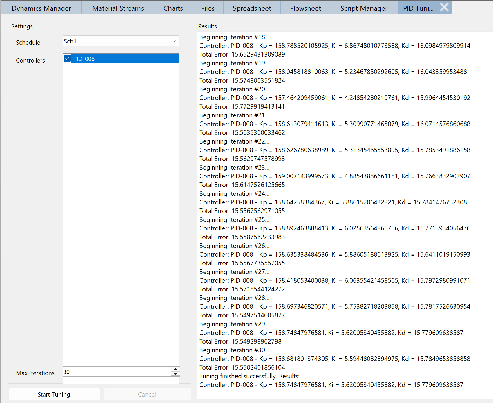
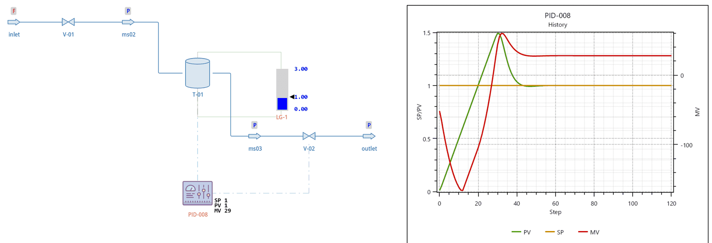
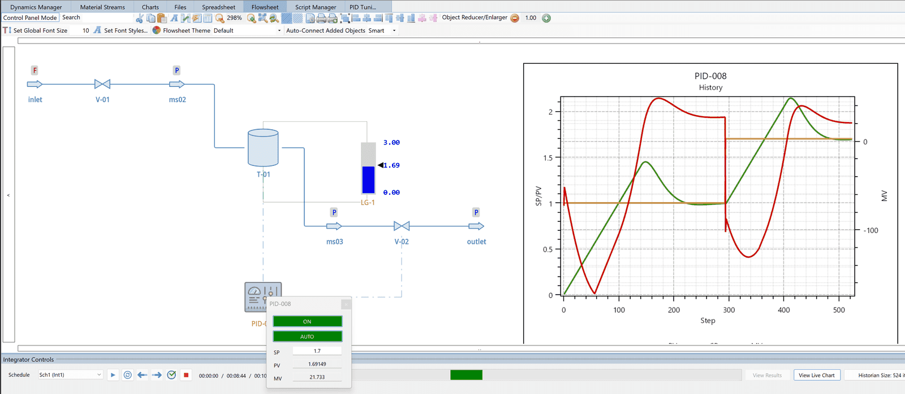

# Basic Dynamic Simulation Tutorial

#### Introduction

In this tutorial, we will learn how to do a dynamic simulation of a water storage tank, adding a PID Controller to keep the liquid level inside the tank around a desired value.

#### DWSIM Model (Classic UI)

Create and configure a new simulation. Add Water as the only compound and use the Steam Tables Property Package.

##### Model Building

1.  Build your model as in the following picture:

    

*Water Tank model*

2.  Enable/Activate **Dynamic Mode**.

3.  Set the inlet stream Pressure to 130000 Pa and Mass Flow to 10 kg/s. On its Stream Conditions tab, set Dynamic P/F Spec to Flow.

    

*Inlet stream properties.*

4.  Set V-01 Calculation Type to Liquid Service Kv/Cv (Deprecated), Kv\[Cv\](max) (IEC 60534) to 100, with Kv selected, leave the Use Opening (%) versus Kv\[Cv\]/Kv\[Cv\]max (%) relationship box unticked and set Valve Opening (%) to 50. The inlet flow is fixed, so V-01 only sets the pressure of ms02; with the box ticked it passes half its Kv and the steady state puts ms02 below atmospheric pressure (0.78 bar).

5.  Set T-01 Volume to 2 m3 and, in its Dynamic Mode Properties panel, Height to 2 m. Leave Reset Content unticked: every run of this tutorial starts from the stored state NewState1, taken while the tank is empty, so the tank starts empty each time.

6.  Set V-02 Calculation Type to Liquid Service Kv/Cv (Deprecated), Kv\[Cv\](max) (IEC 60534) to 400, with Kv selected, tick Use Opening (%) versus Kv\[Cv\]/Kv\[Cv\]max (%) relationship with Opening/Kv\[Cv\] rel. type Linear, and set Valve Opening (%) to 50.

7.  Set the outlet stream Pressure to 101325 Pa. Set its Dynamic P/F Spec to Pressure.

With the above settings, the flow rate of water entering the tank will be fixed at 10 kg/s. The dynamic model for the Tank considers the liquid height contribution (static pressure) for the pressure of the tank’s outlet stream. Since V-02’s outlet stream pressure is fixed, the actual outlet flow will be calculated by the valve using the current opening and the connected stream pressures. As a result, the liquid level inside the tank will vary according to the difference between inlet and outlet flow rates.

##### Dynamic Simulation

1.  Add a Level Gauge and associate it with the Tank’s Liquid Level property. Set its maximum value to 3 m.

2.  Click Store Current (Flowsheet States group of the flowsheet toolbar) and save the current flowsheet state as **NewState1**.

3.  Go to the **Dynamics Manager** and create a new Integrator (Int1) with Integration Step (ms) equal to 5000 and Duration equal to 10 minutes. Add the Tank’s liquid level first, then the openings of the two valves, as Monitored Variables for this integrator.

4.  Create a new Schedule (Sch1), select Int1 as its Associated Integrator, leave Use Current State unticked and select NewState1 as its Initial Flowsheet State.

5.  Open the Integrator Controls Panel, select Sch1 in the Schedule box and click Run Schedule. The liquid level on the tank rises quickly at first (0.23 m after 1 minute) and stabilizes at 0.33 meters after about 7 minutes, where the liquid head pushes exactly 10 kg/s through V-02.

6.  On the Integrator Controls Panel, click on the **View Results** button. On the created Spreadsheet, select the A and B columns (time and liquid level), right-click and select Create 2D XY Chart from Selection. View the generated chart.

    

*Liquid Level versus time.*

##### Adding a PID Controller

1.  Add a PID Controller to the flowsheet and set the V-02’s opening as the manipulated variable and the Tank’s liquid level as the controlled one. The set-point should be equal to 1 (m). Set Kp to 100, Ki and Kd to 0 (a new controller starts with Kp 10, Ki 2 and Kd 2) and tick Reverse Acting. Leave the Manipulated Variable Span on the Advanced tab at 0: the controller then scales its output by the set-point, so with a set-point of 1 m the valve opening is 1 % plus Kp % per metre of level error (Kp 100 opens V-02 by 100 % per metre).

2.  Add a new Chart to the flowsheet and associate it with the PID’s History item.

3.  Open the Integrator Controls Panel and run Sch1 again. V-02 stays shut while the tank fills, and the liquid level stabilizes around 1.25 meters after 3 minutes, with V-02 about 26 % open. With proportional action only, the controller needs a standing error to hold the valve open: this is the offset of proportional control.

4.  Now set the controller’s Ki to 10 and run Sch1 again. The integral action removes the offset: the liquid level rises to about 1.6 meters, swings around the set-point while V-02 moves between shut and fully open, and settles at 1.0 meter after about 8 minutes, with V-02 about 29 % open.

    

*Liquid Level versus time with controller engaged.*

##### PID Controller Tuning

1.  Open the PID Controller Tuning Tool (PID Controller Tuning in the Dynamics menu), select Sch1 in Schedule, tick the controller added to the simulation under Controllers, leave Max Iterations at 30 and click Start Tuning. The tool restores the schedule’s initial state and runs the schedule once per iteration, searching Kp, Ki and Kd for the smallest total error, then writes the best gains to the controller. Starting from Kp 100, Ki 10 and Kd 0 it ends near Kp 159, Ki 5.6 and Kd 15.8, and the total error falls from 21.4 to 15.5. The search has no random part: the same starting gains give the same result, and other starting gains give a different, similar one.

    

*PID Controller Tuning Tool.*

2.  Open the Integrator Controls Panel and run the dynamic simulation. The liquid level peaks near 1.5 meters about 2.5 minutes into the run and stabilizes at 1 meter after 4 to 5 minutes. Notice that there is still a very high overshoot on the liquid level, even after the PID tuning. The cause is the integral term: with the default output limits (-1000 and 1000) the controller never sees V-02 saturate, so while the tank fills the integral runs down to its Wind-Up Guard limit and keeps V-02 shut until the level is well above the set-point. Perhaps you can try tuning it again with different initial values for Kp, Ki and Kd and/or increase the number of optimizer runs. Setting Min. Ouput (Absolute) and Max Output (Absolute) to 0 and 100, the range of the valve opening, stops the wind-up: with the same tuned gains the level then peaks at about 1.14 meters and settles after 3 minutes.

    

*Liquid Level versus time with controller engaged.*

#### Real-Time Mode

1.  Change the flowsheet to **Control Panel Mode**. It should become dark and read-only, i.e. you cannot drag and/or add new objects.

2.  Run the dynamic simulation in real-time mode by clicking on the Real-Time (clock) button on the Integrator Controls Panel. A real-time run starts from the schedule’s initial state, so the tank fills again from empty, and advances one second of process time per second.

3.  After some time, click on the PID Controller and set the SP value to 1.7 (m). Watch how the system reacts to this change: V-02 shuts, the level overshoots to about 2.1 meters, above the 2 m height of the tank (the tank writes a warning to the log, since this model has no overflow), and settles at 1.7 meters about 3 minutes after the change, with V-02 about 22 % open.

    

*Control Panel mode with changes to PID parameters.*

4.  Remember that, after each integrator run, you can click on **View Results** and inspect the values of the monitored variables on that run.

